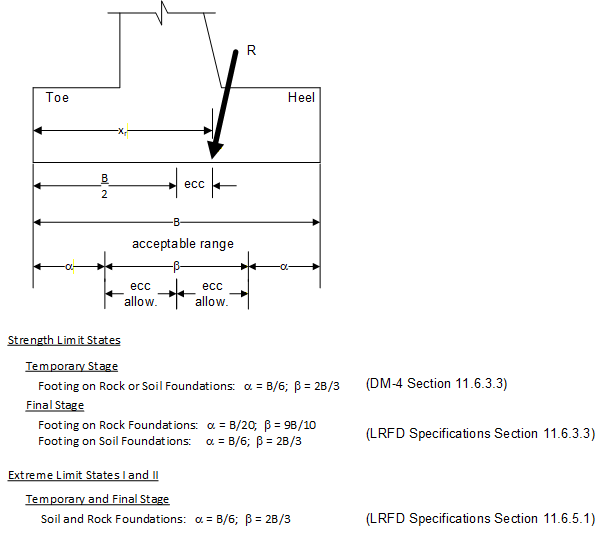
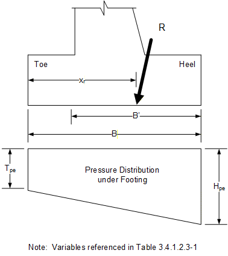
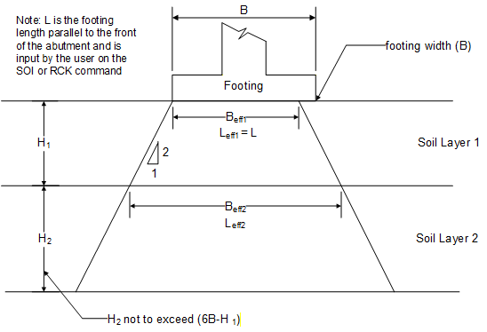
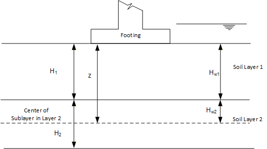
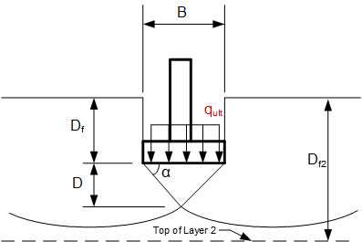
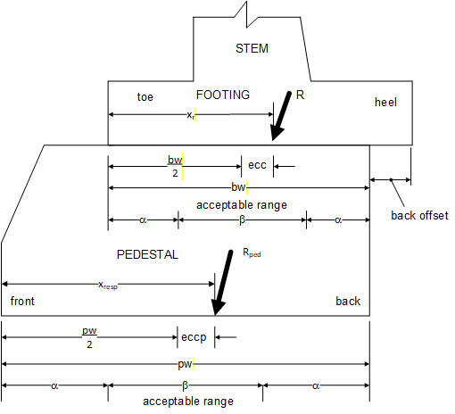
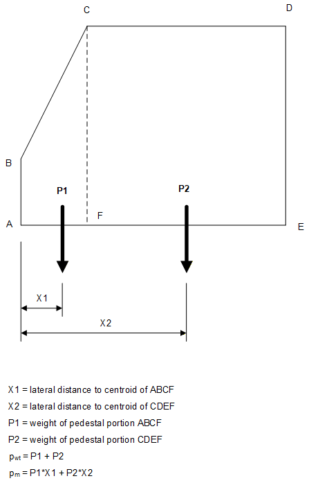
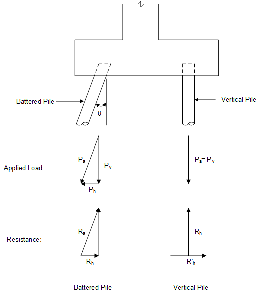

## 3.4 &emsp; Stability

Each footing type has a unique set of checks for stability. The following sections identify the stability checks that are evaluated for each footing type: spread, pedestal and pile.

### Spread Footing Stability

> The stability of spread footings considers: overturning, sliding, settlement, and bearing capacity. Each type of check is described in the sections that follow.

#### Overturning (Eccentricity Check)

> The eccentricity check examines the location of the resultant force relative to the toe of the footing. The distance from the toe to the resultant, X<sub>r</sub>, is calculated by dividing the net overturning moment (from both horizontal and vertical loads) by the net vertical force as illustrated in the equation below:
>
> ``` math
> X_{r} = \frac{VLM + HLM}{VLF}
> ```
>
> For spread footings on rock foundations, the resultant (R) should be situated in the middle nine-tenths of the footing base width for the Final Stage. For spread footings on soil foundations, the resultant (R) should be situated in the middle two-thirds of the base width for the Final Stage as shown in Figure 3.4.1-1. The program calculates an allowable eccentricity and verifies the eccentricity does not exceed the allowable by providing a performance ratio based on these values.



**Figure 3.4.1-1 Stability Check for Spread Footing**

#### Sliding Check for Spread Footings

> The sliding check consists of comparing the factored sliding resistance to the applied horizontal force. Sliding is not a problem if the factored resistance (φ<sub>τ</sub>R) is greater than the applied horizontal force (HLF) as shown in the following equation:

*φ<sub>τ</sub>R ≥ HLF*

> The horizontal force is determined from the minimum load case for all limit states and stages except for the service limit state. The resistance factor φ<sub>τ</sub> is specified by the user in the SOI command. The resistance is a function of the material in the top-most foundation layer and the concrete type of the footing. The following sections identify how the sliding resistance is evaluated.

##### Sliding Resistance of Rock Foundations

> The resistance is a function of the applied vertical force (VLF) and the friction angle (user-specified) of the rock layer, as shown below:

``` math
R = (VLF)\tan\delta
```

##### Sliding Resistance of Sand Foundations

> The value of the cohesion of the soil layer is used to distinguish Sands from Clays. Sands have no cohesion. The following from LRFD Specifications Equation 10.6.3.4-2 is used for sands:

``` math
R = (VLF)\tan\delta
```

Where:

tan δ = tan *φ<sub>f </sub>*for cast-in-place concrete

tan δ = 0.8 \* tan *φ<sub>f </sub>*for precast concrete footing

##### Sliding Resistance of Clay Foundations

The sliding resistance for clays (i.e., when cohesion \> 0.0 and φ<sub>f</sub> = 0.) is based on the relative values of : the undrained shear strength (s<sub>u</sub>); the effective bearing pressures in the footing at the toe (T<sub>pe</sub>) and the heel (H<sub>pe</sub>) locations due to applied loads; and the location of the resultant applied force (x<sub>r</sub>). Table 3.4.1-1 identifies the equations used to compute the unfactored sliding resistance of the soil.

Figure 3.4.1-2 illustrates the variables referenced in Table 3.4.1-1. To find the equation that defines the sliding resistance (defined in the third column); find the row in which x<sub>r</sub> satisfies the condition in column 1; and s<sub>u</sub> satisfies the condition(s) in column 2. Start at the first row and work downwards to find the applicable case.



**Figure 3.4.1-2 Illustration of Pressure Distribution Under Spread Footing**

<table>
<caption><p><span id="_Toc498244228" class="anchor"></span>Table 3.4.1-1 Unfactored Sliding Resistance for Clays</p></caption>
<colgroup>
<col style="width: 23%" />
<col style="width: 31%" />
<col style="width: 45%" />
</colgroup>
<tbody>
<tr>
<td style="text-align: center;"><strong>Location of Resultant</strong></td>
<td style="text-align: center;"><strong>Shear Strength Condition</strong></td>
<td style="text-align: center;"><strong>Sliding Resistance</strong></td>
</tr>
<tr>
<td style="text-align: center;">--</td>
<td style="text-align: center;"><span class="math inline">$s_{u} &lt; \frac{H_{pe}}{2}$</span> &amp; <span class="math inline">$s_{u} &lt; \frac{T_{pe}}{2}$</span></td>
<td style="text-align: center;"><span class="math display"><em>R</em> = <em>s</em><sub><em>u</em></sub><em>B</em></span></td>
</tr>
<tr>
<td style="text-align: center;"><span class="math display">$$x_{r} &lt; \frac{B}{3}$$</span></td>
<td style="text-align: center;"><span class="math display">$$s_{u} &gt; \frac{T_{pe}}{2}$$</span></td>
<td style="text-align: center;"><span class="math display">$$R = \frac{3}{4}T_{pe}x_{r}$$</span></td>
</tr>
<tr>
<td style="text-align: center;"><span class="math display">$$x_{r} &lt; \frac{B}{3}$$</span></td>
<td style="text-align: center;"><span class="math display">$$s_{u} \leq \frac{T_{pe}}{2}$$</span></td>
<td style="text-align: center;"><p><span class="math display">$$R = s_{u}\left( 3x_{r} - D \right) + \frac{1}{2}s_{u}D$$</span></p>
<p>where: <span class="math inline">$D = \frac{6x_{r}s_{u}}{T_{pe}}$</span></p></td>
</tr>
<tr>
<td style="text-align: center;"><span class="math display">$$x_{r} &gt; \frac{2B}{3}$$</span></td>
<td style="text-align: center;"><span class="math display">$$s_{u} &gt; \frac{H_{pe}}{2}$$</span></td>
<td style="text-align: center;"><p><span class="math display">$$R = s_{u}\left( 3\left( B - x_{r} \right) - D \right) + \frac{1}{2}s_{u}D$$</span></p>
<p>where: <span class="math inline">$D = \frac{6\left( B - x_{r} \right)s_{u}}{H_{pe}}$</span></p></td>
</tr>
<tr>
<td style="text-align: center;"><span class="math display">$$x_{r} &gt; \frac{2B}{3}$$</span></td>
<td style="text-align: center;"><span class="math display">$$s_{u} \leq \frac{H_{pe}}{2}$$</span></td>
<td style="text-align: center;"><span class="math display">$$R = \frac{3}{4}\left( H_{pe} + T_{pe} \right)B$$</span></td>
</tr>
<tr>
<td style="text-align: center;"><span class="math display">$$\frac{B}{3}{\leq x}_{r} \leq \frac{2B}{3}$$</span></td>
<td style="text-align: center;"><span class="math inline">$s_{u} &gt; \frac{H_{pe}}{2}$</span> &amp; <span class="math inline">$s_{u} &gt; \frac{T_{pe}}{2}$</span></td>
<td style="text-align: center;"><span class="math display">$$R = \frac{1}{4}\left( H_{pe} + T_{pe} \right)B$$</span></td>
</tr>
<tr>
<td style="text-align: center;"><span class="math display">$$\frac{B}{3}{\leq x}_{r} \leq \frac{2B}{3}$$</span></td>
<td style="text-align: center;"><span class="math display">$$s_{u} &gt; \frac{H_{pe}}{2}$$</span></td>
<td style="text-align: center;"><p><span class="math display">$$R = s_{u}(B - D) + \frac{1}{2}\left( s_{u} + \frac{1}{2}H_{pe} \right)D$$</span></p>
<p>where <span class="math inline">$D = \frac{\left( s_{u} - \frac{1}{2}H_{pe} \right)B}{\frac{1}{2}\left( T_{pe} - H_{pe} \right)}$</span>:</p></td>
</tr>
<tr>
<td style="text-align: center;"><span class="math display">$$\frac{B}{3}{\leq x}_{r} \leq \frac{2B}{3}$$</span></td>
<td style="text-align: center;"><span class="math display">$$s_{u} \leq \frac{H_{pe}}{2}$$</span></td>
<td style="text-align: center;"><p><span class="math display">$$R = s_{u}(B - D) + \frac{1}{2}\left( s_{u} + \frac{1}{2}T_{pe} \right)D$$</span></p>
<p>where <span class="math inline">$D = \frac{\left( s_{u} - \frac{1}{2}T_{pe} \right)B}{\frac{1}{2}\left( H_{pe} - T_{pe} \right)}$</span>:</p></td>
</tr>
</tbody>
</table>

> Legend:
>
> T<sub>pe</sub>, H<sub>pe</sub> = Effective pressure at Toe and Heel; x<sub>r</sub> = load resultant; s<sub>u</sub> = shear strength; B = footing width as illustrated in Figure 3.4.1-2. x<sub>r</sub> is measured from the Toe towards the Heel.

##### Sliding Resistance of Clayey-Sandy “C-Phi” Soils

For soils that have a non-zero cohesion and a non-zero friction angle, the sliding resistance is computed as shown below using DM-4 Equation 10.6.3.4-3:

``` math
R_{\tau} = V\tan\delta + {c}_{a}B'
```

Where (DM-4 Section 10.6.3.4):

``` math
{c}_{a} = c_{}\left( 0.21 + \frac{0.54}{_{}c} \leq 1.0 \right)
```

c in units of ksf

tan δ = tan *φ<sub>f </sub>*for cast-in-place concrete

tan δ = 0.8 \* tan *φ<sub>f </sub>*for precast concrete footing

> The effective width, B', is computed as (variables as shown in Figure 3.4.1-2):

``` math
B' = B - 2\left( \left| \frac{B}{2} - x_{r} \right| \right)
```

#### Settlement of Spread Footings

There are three components to the total settlement of spread footings, namely: elastic, consolidation, and secondary. The total settlement for Rock and Sand foundations consists of the elastic settlement only; the consolidation and secondary settlements are computed for clay and c-phi soil foundations only. Clays and c-phi soils are distinguished from sands by their non-zero cohesive (or undrained) strength.

If the undrained shear strength (s<sub>u</sub>) of clay is less than 4.35 psi the clay is considered to be too soft to be used as a foundation material and the program will exit after printing an error message. A c-phi soil is considered to be too soft to be used as a foundation material if the cohesive strength is less than 4.35 psi and the friction angle is less than 20 degrees.

The uniform bearing pressure (q) used for the elastic settlement equation is determined from the service limit states only. The bearing pressure is computed using the effective width (please refer to the previous section for a definition of effective width). This width is also used to compute the pressure for the consolidation and secondary settlement calculations.

The consolidation settlement uses a bearing pressure that is also based on the service limit states. However, in this case, the live load and LS load are not considered in the load combinations.

The following section describes how each component of the total settlement is calculated.

##### Elastic Settlement

The elastic settlement for a single layer of soil or rock is computed as described below. Two values used by the elastic settlement calculations are B'<sub>1</sub> and L'<sub>1</sub> (also defined in LRFD Specifications Section 10.6.1.3). B'<sub>1</sub> is the effective footing width to be used with rock or the top layer of soil, and is defined as:

> 
> ``` math
> B_{1}' = B - 2\left( \left| \frac{B}{2} - x_{r} \right| \right)
> ```

where: B = total footing width (as shown in Figure 3.4.1-2)

x<sub>r</sub> = distance from the face of the toe to the load resultant (see Figure 3.4.1-2)

Since ABLRFD does not consider eccentricity of load parallel to the face of the abutment, L'<sub>1</sub> is always equal to the "Footing Length (Parallel)" entered on the SOI or RCK command

For a rectangular footing on rock:

> The program uses the lesser of the input rock mass modulus and input intact elastic modulus.
>
> The following equations are based on LRFD Specifications Equations 10.6.2.4.4-3 and 10.6.2.4.4-4 and Table 10.6.2.4.2-1.
>
> ``` math
> E_{m} = MIN\left( E_{m(input)},E_{i} \right)
> ```
>
> ``` math
> x = \frac{L_{1}'}{B_{1}'}
> ```
>
> ``` math
> \beta_{z} = - 0.0005x^{2} + 0.0438x + 1.0271
> ```
>
> ``` math
> I_{p} = \frac{\sqrt{x}}{\beta_{z}}
> ```
>
> ``` math
> CF = B_{1}'\left( 1 - \upsilon^{2}_{}^{} \right)I_{p}
> ```
>
> ``` math
> S_{e} = (CF)\frac{q_{0}}{E_{m}}
> ```
>
> Where:
>
> E<sub>m</sub> is in units of ksf (LRFD Specifications Equation is in units of ksi).
>
> For a rectangular footing on a single layer of soil:
>
> The following equations are based on DM-4 Equation 10.6.2.4.2-1:
>
> ``` math
> E_{s} = E
> ```
>
> ``` math
> CF = \mu_{0}\mu_{1}B_{1}'
> ```
>
> ``` math
> S_{e} = (CF)\frac{q_{0}}{E_{s}}
> ```
>
> Where: μ<sub>o</sub> and μ<sub>1</sub> are the influence factors based on Christian and Carrier’s work (Figure 3.4.1-3).
>
> μ<sub>1</sub> includes the elastic effects of a Poisson's Ratio of 0.5
>
> μ<sub>o</sub> is set to 1.0. Reference DM-4 Section 10.6.2.4.2
>
> E<sub>s</sub> is in units of ksf (DM-4 Equation is in units of ksi).
>
> DM-4 Figure 10.6.2.4.2-2

<span id="_Toc376871663" class="anchor"></span>Figure 3.4.1-3 Settlement Influence Factor based on Christian and Carrier

The elastic settlement for two layers of soil as computed based on one of the following three scenarios:

Scenario 1: If soil layer 2 (lower layer) is much stiffer than the soil layer 1 (top layer), i.e., if E<sub>2</sub> \> 10E<sub>1</sub>, the settlement is calculated as a single layer using the properties of soil layer 1 (top layer). The depth of soil layer 1 is only considered for elastic settlement. The settlement adjustment factor used (shown below) is the same as for a single soil layer.

``` math
CF = \mu_{0}\mu_{1}B_{1}'
```

Scenario 2: If the lower layer (soil layer 2) is softer than the upper layer (soil layer 1), i.e. E<sub>2</sub> \< E<sub>1</sub>, the settlement is calculated using the properties of the lower layer (soil layer 2) and the adjustment factor (CF) is based on the properties of the top layer (soil layer 1) as shown in the equation below:

> 
> ``` math
> CF = \alpha C_{d}\mu_{0}\mu_{1}B_{1}'
> ```
>
> Where: α is interpolated from Table 3.4.1-2.

C<sub>d</sub> is interpolated from Table 3.4.1-3.

> μ<sub>o</sub> is set to 1.0.
>
> μ<sub>1</sub> is a function of: the ratio of depth of soil layer 1 (top layer) to the effective width (H/B'<sub>1</sub>); and the ratio of the length of the footing to the effective width (L'<sub>1</sub>/B'<sub>1</sub>) of the footing. (Note: For scenario 2, H is the total thickness of the two soil layers for calculation of μ<sub>1</sub> and α.
>
> The alpha factor used in the Adjustment Factor (CF) for the Scenario 2 is based on a round footing. The Cd factor is based on a rectangular footing and is used as an approximate correction between the round and rectangular footing. This may lead to exaggerated settlement values under certain conditions.

<span id="_Toc377043215" class="anchor"></span>

Table 3.4.1-2 Elastic Distortion Settlement Factor – α (From Table 4.4 of {FDNHBK})

<table style="width:48%;">
<colgroup>
<col style="width: 4%" />
<col style="width: 7%" />
<col style="width: 7%" />
<col style="width: 7%" />
<col style="width: 7%" />
<col style="width: 7%" />
<col style="width: 7%" />
</colgroup>
<tbody>
<tr>
<td></td>
<td colspan="6" style="text-align: center;">E<sub>1</sub>/E<sub>2</sub></td>
</tr>
<tr>
<td rowspan="9" style="text-align: center;">H<sub>i</sub>/B'</td>
<td style="text-align: center;"></td>
<td style="text-align: center;">1</td>
<td style="text-align: center;">2</td>
<td style="text-align: center;">5</td>
<td style="text-align: center;">10</td>
<td style="text-align: center;">100</td>
</tr>
<tr>
<td style="text-align: center;">0.0</td>
<td style="text-align: center;">1.000</td>
<td style="text-align: center;">1.000</td>
<td style="text-align: center;">1.000</td>
<td style="text-align: center;">1.000</td>
<td style="text-align: center;">1.000</td>
</tr>
<tr>
<td style="text-align: center;">0.1</td>
<td style="text-align: center;">1.000</td>
<td style="text-align: center;">0.972</td>
<td style="text-align: center;">0.943</td>
<td style="text-align: center;">0.923</td>
<td style="text-align: center;">0.760</td>
</tr>
<tr>
<td style="text-align: center;">0.25</td>
<td style="text-align: center;">1.000</td>
<td style="text-align: center;">0.885</td>
<td style="text-align: center;">0.779</td>
<td style="text-align: center;">0.699</td>
<td style="text-align: center;">0.431</td>
</tr>
<tr>
<td style="text-align: center;">0.5</td>
<td style="text-align: center;">1.000</td>
<td style="text-align: center;">0.747</td>
<td style="text-align: center;">0.566</td>
<td style="text-align: center;">0.463</td>
<td style="text-align: center;">0.228</td>
</tr>
<tr>
<td style="text-align: center;">1.0</td>
<td style="text-align: center;">1.000</td>
<td style="text-align: center;">0.627</td>
<td style="text-align: center;">0.399</td>
<td style="text-align: center;">0.287</td>
<td style="text-align: center;">0.121</td>
</tr>
<tr>
<td style="text-align: center;">2.5</td>
<td style="text-align: center;">1.000</td>
<td style="text-align: center;">0.550</td>
<td style="text-align: center;">0.274</td>
<td style="text-align: center;">0.175</td>
<td style="text-align: center;">0.058</td>
</tr>
<tr>
<td style="text-align: center;">5.0</td>
<td style="text-align: center;">1.000</td>
<td style="text-align: center;">0.525</td>
<td style="text-align: center;">0.238</td>
<td style="text-align: center;">0.136</td>
<td style="text-align: center;">0.360</td>
</tr>
<tr>
<td style="text-align: center;">∞</td>
<td style="text-align: center;">1.000</td>
<td style="text-align: center;">0.500</td>
<td style="text-align: center;">0.200</td>
<td style="text-align: center;">0.100</td>
<td style="text-align: center;">0.010</td>
</tr>
</tbody>
</table>

<span id="_Toc377043216" class="anchor"></span>

Table 3.4.1-3 Shape and Rigidity Factor – C<sub>d</sub> ( From Table 4.1 of {FDNHBK})

<table style="width:32%;">
<colgroup>
<col style="width: 22%" />
<col style="width: 9%" />
</colgroup>
<tbody>
<tr>
<td colspan="2" style="text-align: center;"><p>C<sub>d</sub></p>
<p>for settlements at center of rectangle</p></td>
</tr>
<tr>
<td style="text-align: center;">L'/B' = 1.0</td>
<td style="text-align: center;">1.12</td>
</tr>
<tr>
<td style="text-align: center;">L'/B' = 1.5</td>
<td style="text-align: center;">1.36</td>
</tr>
<tr>
<td style="text-align: center;">L'/B' = 2.0</td>
<td style="text-align: center;">1.52</td>
</tr>
<tr>
<td style="text-align: center;">L'/B' = 3.0</td>
<td style="text-align: center;">1.78</td>
</tr>
<tr>
<td style="text-align: center;">L'/B' = 5.0</td>
<td style="text-align: center;">2.10</td>
</tr>
<tr>
<td style="text-align: center;">L'/B' = 10</td>
<td style="text-align: center;">2.53</td>
</tr>
<tr>
<td style="text-align: center;">L'/B' = 100</td>
<td style="text-align: center;">4.00</td>
</tr>
<tr>
<td style="text-align: center;">L'/B' = 1000</td>
<td style="text-align: center;">5.47</td>
</tr>
<tr>
<td style="text-align: center;">L'/B' = 10000</td>
<td style="text-align: center;">6.90</td>
</tr>
</tbody>
</table>

> Scenario 3: If neither scenario described above applies, then the elastic settlement is equal to the sum of the settlement for each layer. The settlement for each layer is calculated by applying the properties of each layer in the formulation of the single layer soil described earlier. However, the thickness of the lower layer of soil will be the lesser of H<sub>2</sub> and (6B - H <sub>1</sub>). For the lower layer, the pressure and effective width of the footing used in the settlement equation are determined by the following relations:

``` math
B_{2}' = B_{1}' + H_{1}
```

``` math
q_{2} = q_{1}\left( \frac{B_{1}'}{B_{2}'} \right)\left( \frac{L_{1}'}{L_{2}'} \right)
```

``` math
L_{2}' = L_{1}' + H_{1}
```

> The relationship between B'<sub>1</sub> and B'<sub>2</sub> is illustrated in Figure 3.4.1-4. Since the loads entering the footing are always perpendicular to the length of the foundation, the L'<sub>1</sub> length is equal to the total length of the footing due to lack of eccentricity in the length plane.



**Figure 3.4.1-4 Considerations for Settlement for Two Layers of Soil**

##### Consolidation Settlement of Clays (and C- φ Soils)

> Consolidation Settlement is calculated for clay soils when water is present in the soil layer(s). This settlement is a result of the excess water being forced out of the layer, allowing the soil to increase in density. The program however, always assumes the soil layer(s) are saturated and will consider the entire layer for consolidation regardless of water presence. It is possible to exclude the effects of primary consolidation for a layer by setting C<sub>c</sub> and C<sub>cr</sub> to zero for that layer. Also it is important to note that the settlement calculations performed by the program do not consider effects of an adjacent embankment ( for more information refer to Section 6.20). The consolidation settlement is calculated by subdividing each clay and (and C - φ soil) layer. The number of sublayers is calculated by dividing the layer thickness by 5 ft (1.5m) and rounding to the nearest integer. The consolidation settlement (Sc) is equal to the sum of the consolidation settlement (Sc<sub>i</sub>) for each sublayer.
>
> NOTE: the solution employed in the program ignores the effect of soil removed by excavation to construct the footing. This is conservative, if a more detailed analysis considering this effect is required the user should perform independent calculations.

``` math
S_{c} = \sum_{i = 1}^{nsub}S_{ci}
```

> The depth of soil considered for the settlement is restricted to the lesser of: the depth of the lower soil layer or 6 \* B below the bottom of footing.
>
> The Final Effective Stress of each soil sublayer is computed using the Boussinesq Equation (equation 5-8 of \[BOWLES\]) based on the corner of a rectangular region.
>
> Initial Effective Stress

<u>Layer 1</u>

> $`\sigma_{o1}' = \sigma_{o1t}' + \gamma_{s1}Z - \gamma_{w}H_{w1}`$

<u>Layer 2</u>

> $`\sigma_{o2}' = \sigma_{o2t}' + \gamma_{s2}\left( Z - H_{1} \right) - \gamma_{w}H_{w2}`$

Maximum Past Effective Stress

<u>Layer 1</u>

 The interpolated value between σ'<sub>p1 Top</sub> and σ'<sub>p1 Bottom</sub> at Z

<u>Layer 2</u>

 The interpolated value between σ'<sub>p2 Top</sub> and σ'<sub>p2 Bottom</sub> at Z

Final Effective Stress

<u>Layer 1</u>

> $`\sigma_{f1}' = 4\sigma_{b}'L_{fact(Z)} + \sigma_{o1}'`$

<u>Layer 2</u>

> $`\sigma_{f2}' = 4\sigma_{b}'L_{fact(Z)} + \sigma_{o1t}' + \gamma_{s1}H_{1} - \gamma_{w}H_{w1} + \gamma_{s2}\left( Z - H_{1} \right) - \gamma_{w}H_{w2}`$
>
> NOTE: this form of the final effective stress equation is used to accommodate special cases as described in section 6.20.6
>
> Where: Z = Distance from the bottom of footing to center of sublayer (Figure 3.4.1-5).
>
> H<sub>1</sub> = Depth of soil layer 1 (upper layer) used for settlement calculations
>
> H<sub>w1</sub> = Height of water above center of sublayer in Layer 1 (Figure 3.4.1-5)
>
> H<sub>w2</sub> = Height of water above center of sublayer in Layer 2 (Figure 3.4.1-5)
>
> H<sub>w1</sub> and H<sub>w2</sub> are limited to the maximum height of the soil layer.
>
> L<sub>fact</sub> = influence factor

     γ<sub>s</sub> = unit weight of saturated soil (kcf)

     γ<sub>w</sub> = unit weight of water (kcf)

> σ’<sub>o1</sub> & σ’<sub>o2</sub> = Initial effective stress at center of soil sublayer (ksi)
>
> σ’<sub>p1</sub> & σ’<sub>p2</sub> = Maximum past effective stress at center of soil sublayer (ksi)
>
> σ’<sub>f1</sub> & σ’<sub>f2</sub> = Final effective stress at center of soil sublayer (ksi)
>
> σ'<sub>o1t</sub> & σ'<sub>o2t</sub> = Initial effective stress at top of soil layer (input) (ksi)
>
> σ'<sub>p1 top</sub> & σ'<sub>p2 top</sub> = Maximum past effective stress at top of soil layer (input) (ksi)
>
> σ'<sub>p1 bottom</sub> & σ'<sub>p2 bottom</sub> = Maximum past effective stress at bottom of soil layer (input) (ksi)
>
> σ'<sub>f1t</sub> = Final effective stress at top of soil layer 1 (ksi)
>
> $`\sigma_{b}'`$ = the effective bearing pressure at the bottom of the footing calculated using effective footing dimension $`B_{1}'`$ (Figure 3.4.1-4)



**Figure 3.4.1-5 Description of Z and Hw values**

The influence factor used in the equation is calculated as per equation 5-8 of \[Bowles\]. The influence factor is based on the geometry of the footing and always uses the effective dimensions of the foundation at the bottom of the footing. The factor is a function of the footing geometry and the depth of the soil layer as shown below:


Arc Tangent is in Radians

Where: $`n = \frac{0.5{L'}_{1}}{Z}`$

> $`m = \frac{0.5{B'}_{1}}{Z}`$
>
> 


When *p*<sup>2</sup> \> q, the tan<sup>-1</sup> term is negative and it is necessary to add π.

The effective soil pressure is evaluated for each sub-layer. It is used with the compression index (C<sub>c</sub>), recompression index (C<sub>cr</sub>), and void ratio (e<sub>o</sub>) at initial vertical effective stress to compute the consolidation settlement for the *I <sup>th</sup>* sub-layer as show below. The Ccr and Cc values used by the program are based on the void ratio definition.

For Over-Consolidated Soils $`\left( \sigma_{p}' > \sigma_{o}' \right)`$

> 
> ``` math
> S_{ci} = \frac{\Delta h}{1 + e_{o}}\left\lbrack C_{cr}\text{log}\frac{\sigma_{f}'}{\sigma_{p}'} + C_{c}\text{log}\frac{\sigma_{f}'}{\sigma_{p}'} \right\rbrack\ \text{if}{\ \sigma}_{f}' > \sigma_{p}'
> ```
>
> ``` math
> S_{ci} = \frac{\Delta h}{1 + e_{o}}\left\lbrack C_{cr}\text{log}\frac{\sigma_{f}'}{\sigma_{p}'} \right\rbrack\ \text{if}{\ \sigma}_{f}' \leq \sigma_{p}'
> ```

For Normally-Consolidated Soils$`\ \left( \sigma_{p}' = \sigma_{o}' \right)`$

> 
> ``` math
> S_{ci} = \frac{\Delta h}{1 + e_{o}}\left\lbrack C_{c}\text{log}\frac{\sigma_{f}'}{\sigma_{p}'} \right\rbrack\ 
> ```

For Under-Consolidated Soils $`\left( \sigma_{p}' < \sigma_{o}' \right)`$

> The ABLRFD program does not consider settlement for Under-Consolidated soil. If Under-consolidation is encountered, the input file should be checked for errors. Hand calculations are required along with approval from the Chief Bridge Engineer. If Under-Consolidation is detected during a design run, a warning will be issued and primary consolidation settlement will be calculated assuming a normal consolidation condition.
>
> For the total settlement of the first layer of soil only, a settlement factor based on the average over consolidation ratio (OCR) is applied. The OCR is computed for each sublayer and the average is then applied to the figure below. This factor is based on LRFD Specifications Figure 10.6.2.4.3-3
>
> 
>
> LRFD Specifications Figure 10.6.2.4.3-3

<span id="_Toc376871666" class="anchor"></span>Figure 3.4.1-6 Consolidation Settlement Reduction Factor


If the total settlement is less than zero, the program will provide a secondary calculation for total settlement which combines the elastic and secondary settlement values for the total settlement.


##### Secondary Settlement of Clays (and C-φ Soils)

> The secondary settlement is calculated using the same sublayers as for the consolidation settlement. The secondary settlement (S<sub>s</sub>) is equal to the sum of the secondary settlement (S<sub>si</sub>) for each sublayer. This settlement starts at the end of primary consolidation settlement.

``` math
S_{s} = \sum_{i = 1}^{nsub}S_{si}
```

The secondary settlement is a function of the: coefficient of secondary compression (C<sub>α</sub>); the time interval (t<sub>2</sub>, t<sub>1</sub>) for which the settlement is being computed; and, the thickness of the sub-layer. The Coefficient of Secondary Compression used by the program is based on the Strain definition:

``` math
S_{si} = \Delta h\left\lbrack C_{\alpha}\text{log}\frac{t_{2}}{t_{1}} \right\rbrack
```

##### Allowable Settlement

> The acceptable total settlement is set by the program to a default value of 1 inch. The user may override this value (See the SOI and RCK commands in Chapter 5). However, a warning message is still issued if the total settlement exceeds the program default value of allowable settlement.

#### Bearing Capacity Check

> The bearing capacity check consists of comparing the factored bearing resistance of the soil (or rock) foundation to the factored applied loads at the bottom of footing level. The check is evaluated for all applicable limit states / stages / load cases*.* The applied pressure due to the factored applied loads depends on several factors and is described in Section 3.4.1.4.3.

##### Bearing Capacity of Rock Foundations

> The user is responsible for specifying the bearing capacity of rock foundations. The capacity is specified using the RCK command in Chapter 5.

##### Bearing Capacity of Clay and Sand Foundations

The bearing capacity of soft soils is not computed. The definition of a soft soil can be found in Section 3.4.1.3 (discussion of settlement).

The factored bearing capacity of the soil is the lesser value of φq<sub>ult</sub> and \[(0.7)(0.85)(f'<sub>c</sub>)\]. For multi-layer soils, q<sub>ult</sub> is typically calculated using properties based on a “weighted average” of the soil layers, except when a multi-layer capacity is used.

The effective footing width and length values are used in the bearing capacity calculations as defined in LRFD Specifications Section 10.6.1.3

The depth to the ground water level from the bottom of the footing (z<sub>w</sub>) is used in the bearing capacity calculations and is based on the back water level entered on the AT1, AT2, AWB, or RWL command cards. This value will be less than zero when the water level is above the bottom of the footing.

The program classifies all soil into one of 4 Soil Classifications. Three of the soil classifications contain 3 Soil Conditions. The table below lists the categories and conditions for soil typing.

<table style="width:94%;">
<caption><p><span id="_Toc179016024" class="anchor"></span>Table 3.4.1-4 Soil Categories and Conditions</p></caption>
<colgroup>
<col style="width: 9%" />
<col style="width: 9%" />
<col style="width: 8%" />
<col style="width: 8%" />
<col style="width: 10%" />
<col style="width: 8%" />
<col style="width: 18%" />
<col style="width: 17%" />
</colgroup>
<tbody>
<tr>
<td style="text-align: center;">Soil Category</td>
<td style="text-align: center;">Soil Condition</td>
<td style="text-align: center;">Number of Layers</td>
<td style="text-align: center;">Clay  φ<sub>f</sub>=0 &amp; c=0 &amp; s<sub>u</sub>&gt;0</td>
<td style="text-align: center;"><p>Sand</p>
<p> 20&lt;φ<sub>f</sub>&lt;60 &amp; c=0</p>
<p>&amp; s<sub>u</sub>=0</p></td>
<td style="text-align: center;"><p>Mixed</p>
<p> φ<sub>f</sub>&gt;0</p>
<p>&amp; c&gt;0</p>
<p>&amp; s<sub>u</sub>=0</p></td>
<td style="text-align: center;">Condition</td>
<td style="text-align: center;">Description *</td>
</tr>
<tr>
<td style="text-align: center;">1</td>
<td style="text-align: center;">1</td>
<td style="text-align: center;">1</td>
<td colspan="3" style="text-align: center;">Clay, Sand, or Mixed Layer</td>
<td style="text-align: center;">One layer of clay, sand, or mixed</td>
<td style="text-align: center;">Single Layer</td>
</tr>
<tr>
<td rowspan="3" style="text-align: center;">2</td>
<td style="text-align: center;">2</td>
<td style="text-align: center;">2</td>
<td style="text-align: center;">Two Layers</td>
<td style="text-align: center;"> </td>
<td style="text-align: center;"> </td>
<td style="text-align: center;">c<sub>1</sub> &lt; c<sub>2</sub></td>
<td style="text-align: center;">Weak Clay over Strong Clay</td>
</tr>
<tr>
<td style="text-align: center;">3</td>
<td style="text-align: center;">2</td>
<td style="text-align: center;">Two Layers</td>
<td style="text-align: center;"> </td>
<td style="text-align: center;"> </td>
<td style="text-align: center;">c<sub>1</sub> &gt; c<sub>2</sub></td>
<td style="text-align: center;">Strong Clay over Weak Clay</td>
</tr>
<tr>
<td style="text-align: center;">9</td>
<td style="text-align: center;">2</td>
<td style="text-align: center;">One Layer</td>
<td style="text-align: center;"> </td>
<td style="text-align: center;">One Layer</td>
<td style="text-align: center;">One Layer Clay One Layer Mixed</td>
<td style="text-align: center;">Mixed Soil with Clay - Undrained</td>
</tr>
<tr>
<td rowspan="7" style="text-align: center;">3</td>
<td rowspan="3" style="text-align: center;">4</td>
<td rowspan="3" style="text-align: center;">2</td>
<td style="text-align: center;">One Top Layer</td>
<td style="text-align: center;">One Bottom Layer</td>
<td style="text-align: center;">One Top Layer</td>
<td style="text-align: center;">D &gt; H<sub>1</sub></td>
<td style="text-align: center;">Clay or Mixed Soil over Sand</td>
</tr>
<tr>
<td style="text-align: center;">One Bottom Layer</td>
<td style="text-align: center;">One Top Layer</td>
<td style="text-align: center;">One Bottom Layer</td>
<td style="text-align: center;">D &gt; H<sub>1</sub></td>
<td style="text-align: center;"><p>Sand over Clay or Mixed Soil</p>
<p>( φ<sub>f1</sub> &lt; 25 <sup>O</sup> or</p>
<p>φ<sub>f1</sub> &gt; 50 <sup>O</sup>)</p></td>
</tr>
<tr>
<td style="text-align: center;"></td>
<td style="text-align: center;"></td>
<td style="text-align: center;"> Two Layers</td>
<td style="text-align: center;">D &gt; H<sub>1</sub></td>
<td style="text-align: center;">Mixed Soil over Mixed Soil</td>
</tr>
<tr>
<td rowspan="3" style="text-align: center;">5</td>
<td rowspan="3" style="text-align: center;">2</td>
<td style="text-align: center;">One Top Layer</td>
<td style="text-align: center;">One Bottom Layer</td>
<td style="text-align: center;">One Top Layer</td>
<td style="text-align: center;">D ≤ H<sub>1</sub></td>
<td style="text-align: center;">Clay or Mixed Soil over Sand</td>
</tr>
<tr>
<td style="text-align: center;">One Bottom Layer</td>
<td style="text-align: center;">One Top Layer</td>
<td style="text-align: center;">One Bottom Layer</td>
<td style="text-align: center;">D ≤ H<sub>1</sub></td>
<td style="text-align: center;"><p>Sand over Clay or Mixed Soil</p>
<p>( φ<sub>f1</sub> &lt; 25 <sup>O</sup> or</p>
<p>φ<sub>f1</sub> &gt; 50 <sup>O</sup>)</p></td>
</tr>
<tr>
<td style="text-align: center;"></td>
<td style="text-align: center;"></td>
<td style="text-align: center;">Two Layers</td>
<td style="text-align: center;">D ≤ H<sub>1</sub></td>
<td style="text-align: center;">Mixed Soil over Mixed Soil</td>
</tr>
<tr>
<td style="text-align: center;">8</td>
<td style="text-align: center;">2</td>
<td style="text-align: center;">One Bottom Layer</td>
<td style="text-align: center;">One Top Layer</td>
<td style="text-align: center;">One Bottom Layer</td>
<td style="text-align: center;">Top Layer Sand over a Bottom Layer of Clay or Mixed Soil</td>
<td style="text-align: center;"><p>Sand over Clay or Mixed Soil</p>
<p> (25 <sup>O</sup> ≤ φ<sub>f1</sub> ≤ 50 <sup>O</sup>)</p></td>
</tr>
<tr>
<td rowspan="3" style="text-align: center;">4</td>
<td style="text-align: center;">6</td>
<td style="text-align: center;">2</td>
<td style="text-align: center;"> </td>
<td style="text-align: center;">Two Layers</td>
<td style="text-align: center;"> </td>
<td style="text-align: center;">H<sub>1</sub> &lt; 2B' &amp; φ<sub>f1</sub> &gt; φ<sub>f2</sub></td>
<td style="text-align: center;">Dense Sand over Loose Sand</td>
</tr>
<tr>
<td style="text-align: center;">7</td>
<td style="text-align: center;">2</td>
<td style="text-align: center;"> </td>
<td style="text-align: center;">Two Layers</td>
<td style="text-align: center;"> </td>
<td style="text-align: center;">H<sub>1</sub> &lt; 2B' &amp; φ<sub>f1</sub> &lt; φ<sub>f2</sub></td>
<td style="text-align: center;">Loose Sand over Dense Sand</td>
</tr>
<tr>
<td style="text-align: center;">10</td>
<td style="text-align: center;">2</td>
<td style="text-align: center;"> </td>
<td style="text-align: center;">Two Layers</td>
<td style="text-align: center;"> </td>
<td style="text-align: center;">H<sub>1</sub> ≥ 2B'</td>
<td style="text-align: center;">Two Sand Layers</td>
</tr>
</tbody>
</table>

> \* To better clarify the calculations, the categories will be sub-divided into Soil Conditions below. The calculations are displayed in reverse order meaning the main bearing equation is listed first, then all secondary equations used to determine the main equation are listed after.



**Figure 3.4.1-7 Df1 and Df2 definitions (from Bowles Second Edition Figure 4-3)**

> <u>Category Independent Calculations</u>
>
> The following shows calculations for values generally used by most Categories and Soil Conditions
>
> Bearing Resistance = q<sub>ult</sub>\*φ , where φ is the strength reduction factor applied to bearing resistance
>
> $`D = 0.5B'\tan\left( 45 + \frac{\phi_{f}}{2} \right)`$ Effective Shear Depth
>
> DM-4 Equation 10.6.3.1.2gP-6
>
> $`\phi_{f} = \tan^{- 1}\left( \frac{H_{1}\tan{\phi_{if1} + \left( D - H_{1} \right)\tan\phi_{if2}}}{D} \right)`$ Average Soil Friction Angle for Multiple Layers (Bowles Section 4-8, Fourth Edition)
>
> $`N_{q} = e^{\pi\tan\phi_{f}}\tan^{2}\left( 45 + \frac{\phi_{f}}{2} \right)`$ DM-4 Equation C10.6.3.1.2a-1
>
> $`B' = B - 2e_{B}`$ LRFD Specifications Equation 10.6.1.3-1
>
> $`L' = L - 2e_{L}`$ LRFD Specifications Equation 10.6.1.3-1
>
> Where:
>
> If e<sub>B</sub> or e<sub>L</sub> are \< 0 then; e<sub>B</sub> = \|-e<sub>B</sub>\| and e<sub>L</sub> = \|-e<sub>L</sub>\|
>
> <u>Note</u>: L' = L since e<sub>L</sub> is always 0

###### Category 1 - Soil Condition 1: Single Soil Layer

> For bearing resistance the equations used are shown below.
>
> $`\text{q}_{n}\text{=c}\text{N}_{\text{c}}\text{s}_{\text{c}}\text{i}_{\text{c}}\text{+0.5γ}B'\text{N}_{\text{γ}}\text{s}_{\text{γ}}\text{i}_{\text{γ}}\text{+γ}\text{D}_{\text{f}}\text{N}_{\text{q}}\text{s}_{\text{q}}\text{i}_{\text{q}}`$ DM-4 Equation 10.6.3.1.2a-10
>
> D<sub>f</sub> in the equation above may be either D<sub>f1</sub> or D<sub>f2</sub>, depending on the soil category and soil condition. The following sections specify which value, D<sub>f1</sub> or D<sub>f2</sub>, to use as D<sub>f</sub>.
>
> For footings on or near a slope, the embedment term ($`\text{γ}\text{D}_{\text{f}}\text{N}_{\text{q}}\text{s}_{\text{q}}\text{i}_{\text{q}}`$) is neglected. As per the LRFD Specifications Section C10.6.3.1.2c, the RC<sub>BC</sub> factors used to correct for footings on or near a slope are based on no footing embedment. Also, for footings on or near a slope, q<sub>ult</sub> is multiplied by the adjustment factor (entered by the user), RC<sub>BC</sub>:
>
> $`\text{q}_{n}\text{=}{RC}_{BC}\left( cN_{c}s_{c}i_{c} + 0.5\gamma B'N_{\gamma}s_{\gamma}i_{\gamma} \right)`$ NOTE: Used only for footings on or near a slope

Input for Condition 1 - Single Layer

``` math
\gamma_{m} = \gamma_{im}
```

``` math
\gamma_{s} = \ \gamma_{is}
```

``` math
\phi_{f} = \phi_{if}
```

``` math
c = c_{i}
```

``` math
D_{f} = D_{f1}
```

> 
> ``` math
> {RC}_{BC} = {RC}_{BC1}
> ```
>
> <u>Calculation of Gamma ( γ )</u>
>
> ``` math
> \gamma' = \gamma_{s} - \gamma_{w}
> ```
>
> <u>If z<sub>w</sub> is ≤ 0</u>
>
> $`\gamma = \gamma'`$ DM-4 Equations 10.6.3.1.2gP-3,7
>
> <u>If 0\< z<sub>w</sub> \< B' and φ<sub>f</sub> \< 37°</u>
>
> $`\gamma = \gamma' + \frac{{z}_{w}}{B'}\left( \gamma_{m} - \gamma' \right)`$ DM-4 Equation 10.6.3.1.2gP-2
>
> Where γ<sub>m</sub> is the moist unit weight of soil
>
> <u>If z<sub>w</sub> ≥ B' and φ<sub>f</sub> \< 37° and z<sub>w</sub> ≥ D</u>
>
> $`\gamma = \gamma_{m}`$ DM-4 Equations 10.6.3.1.2gP-1,4
>
> <u>If 0\< z<sub>w</sub> \< B' and φ<sub>f</sub> ≥ 37° and z<sub>w</sub> \<D</u>
>
> $`\gamma = \left( 2D - {z}_{w} \right)\frac{{z}_{w}\gamma_{m}}{D^{2}} + \frac{\gamma'}{D^{2}}\left( D - {z}_{w} \right)^{2}`$ DM-4 Equation 10.6.3.1.2gP-5
>
> <u>Calculation of N<sub>c</sub>, N<sub>q</sub>, and N<sub>γ</sub></u>
>
> $`N_{q} = e^{\pi\tan\left( \phi_{f} \right)}\tan\left( 45{^\circ} + \frac{\phi_{f}}{2} \right)`$ DM-4 Equation C10.6.3.1.2a-1
>
> $`N_{\gamma} = 2\left( N_{q} + 1 \right)\tan\phi_{f}`$ DM-4 Equation C10.6.3.1.2a-4
>
> <u>If φ<sub>f</sub> ≠ 0</u>
>
> $`N_{c} = \left( N_{q} - 1 \right)\cot\phi_{f}`$ DM-4 Equation C10.6.3.1.2a-2
>
> <u>If φ<sub>f</sub> = 0</u>
>
> $`N_{c} = 5.14`$ DM-4 Equation C10.6.3.1.2a-3
>
> <u>Calculation of s<sub>c</sub>, s<sub>q</sub>, and s<sub>γ</sub></u>
>
> <u>If L' \> 5B'</u>
>
> $`s_{c},s_{\gamma},\ and\ s_{q} = 1.0`$ DM-4 Section 10.6.3.1.2a
>
> <u>If L' ≤ 5B'</u>
>
> LRFD Specifications Table 10.6.3.1.2a-3:

| Friction Angle | Cohesion Term (s<sub>c</sub>)\*\* | Unit Weight Term (s<sub>γ</sub>) | Surcharge Term (s<sub>q</sub>) |
|:--:|:--:|:--:|:--:|
| φ<sub>f</sub> = 0 | 
``` math
1 + \frac{B'}{5L'}
``` | 1.0 | 1.0 |
| φ<sub>f</sub> \> 0 | 
``` math
1 + \frac{B'N_{q}}{L'N_{c}}
``` | 
``` math
1 - 0.4\frac{B'}{L'}
``` | 
``` math
1 + \frac{B'}{L'}\tan\phi_{f}
``` |

> \*\*NOTE: If φ<sub>f</sub> \> 0 and c (cohesion) = 0, s<sub>c</sub> is set to 1.0. When c equals 0, the entire first term of DM-4 Equation 10.6.3.1.2a-10 will equal zero, so the value of s<sub>c</sub> does not ultimately matter.
>
> <u>Calculation of i<sub>c</sub>, i<sub>q</sub>, and i<sub>γ</sub></u>
>
> <u>If H<sub>u</sub> = 0.0</u>
>
> i<sub>c</sub>, i<sub>q</sub>, and i<sub>γ</sub> = 1
>
> <u>If H<sub>u</sub> ≠ 0.0</u>
>
>  Based on LRFD Specifications Figure C10.6.3.1.2a-1
>
> $`n = \frac{2 + \frac{L'}{B'}}{1 + \frac{L'}{B'}}\cos^{2}(\theta) + \frac{2 + \frac{B'}{L'}}{1 + \frac{B'}{L'}}\sin^{2}(\theta)`$ LRFD Specifications Equation 10.6.3.1.2a-9
>
> ε = 0.01 degrees = Angle tolerance
>
> $`i_{q} = \left\lbrack 1 - \frac{H_{u}L_{foot}}{V_{u}L_{foot} + B'L'c\ cot\left( \phi_{f} + \varepsilon \right)} \right\rbrack^{n}`$ LRFD Specifications Equation 10.6.3.1.2a-7
>
> $`i_{\gamma} = \left\lbrack 1 - \frac{H_{u}L_{foot}}{V_{u}L_{foot} + B'L'c\ cot\left( \phi_{f} + \varepsilon \right)} \right\rbrack^{n + 1}`$ LRFD Specifications Equation 10.6.3.1.2a-8
>
> <u>If φ<sub>f</sub> = 0</u>
>
> $`i_{c} = 1 - \frac{nH_{U}L_{foot}}{B'L'cN_{c}}`$ LRFD Specifications Equation 10.6.3.1.2a-5
>
> <u>If φ<sub>f</sub> ≠ 0 and c = 0</u>
>
> $`i_{c} = 0`$
>
> <u>If φ<sub>f</sub> ≠ 0 and c ≠ 0</u>
>
> $`i_{c} = i_{q} - \frac{1 - i_{q}}{\left( N_{q} - 1 \right)}`$ LRFD Specifications Equation 10.6.3.1.2a-6
>
> NOTE: The H<sub>U</sub> and V<sub>U</sub> values used in the equations above are calculated in units of kips/ft and must be multiplied by the full length of the footing (L<sub>foot</sub>, entered by the user on the SOI command) to obtain the full footing load.

###### Category 2 - Two Clay layers or Undrained Two Layer Mixed Soil

> Equation for bearing resistance for footings NOT on or near a slope:
>
> $`q_{n} = c_{1}N_{m} + \gamma D_{f}`$ (Eq 3.4.1.4.2.2-1) DM-4 Equation 10.6.3.1.2e-4
>
> Equation for bearing resistance for footings on or near a slope (embedment neglected due to LRFD Specifications Section C10.6.3.1.2c:
>
> $`q_{n} = {RC}_{BC1}\left( c_{1}N_{m} \right)`$ (Eq 3.4.1.4.2.2-2)
>
> Equations needed for N<sub>m</sub> (both equations use these values)
>
> ``` math
> \kappa = \frac{c_{2\ }}{{c}_{1\ }}
> ```
>
> If *κ* \< 0.6, the soil is undesirable and the program will stop with an error.
>
> $`\beta_{m} = \frac{B'L'}{2\left( B' + L' \right)H_{1}}`$ LRFD Specifications Equation 10.6.3.1.2e-2
>
> The average φ<sub>f</sub>
>
> $`\phi_{f} = \tan^{- 1}\left( \frac{H_{1}\tan{\phi_{if1} + \left( D - H_{1} \right)\tan\phi_{if2}}}{D} \right)`$ (Bowles Section 4-8)
>
> N<sub>c</sub>, N<sub>q</sub>, and N<sub>γ</sub> are computed using equations from Category 1
>
> The average moist soil γ<sub>m</sub>
>
> ``` math
> \gamma_{m} = \frac{H_{1}\gamma_{im1} + \left( D - H_{1} \right)\gamma_{im2}}{D}
> ```
>
> The average saturated soil γ<sub>s</sub>
>
> ``` math
> \gamma_{s} = \frac{H_{1}\gamma_{is1} + \left( D - H_{1} \right)\gamma_{is2}}{D}
> ```
>
> γ is computed using equations from Category 1

s<sub>c</sub> is computed using equations from Category 1

> 
> ``` math
> D_{f} = D_{f1}
> ```
>
> **<u>Category 2: Soil Condition 2 - Weaker clay over stronger clay - Undrained</u>**
>
> Soil Correction Factor for use in Equation 3.4.1.4.2.2-1:
>
> ``` math
> N_{m} = \frac{\kappa N_{c}\left( N_{c} + \beta_{m} - 1 \right)\left\lbrack (\kappa + 1)N_{c}^{2} + \left( 1 + \kappa\beta_{m} \right)N_{c} + \beta_{m} - 1 \right\rbrack}{\left\lbrack \kappa(\kappa + 1)N_{c} + \kappa + \beta_{m} - 1 \right\rbrack\left\lbrack \left( N_{c} + \beta_{m} \right)N_{c} + \beta_{m} - 1 \right\rbrack - \left( \kappa N_{c} + \beta_{m} - 1 \right)\left( N_{c} + 1 \right)}
> ```
>
> (Eq 3.4.1.4.2.2-3)
>
> (Winterkorn and Fang 3.37)
>
> **<u>Category 2: Soil Condition 3 - Stronger clay over weaker clay - Undrained</u>**
>
> Soil Correction Factor for use in Equation 3.4.1.4.2.2-1
>
> $`N_{m} = \frac{1}{\beta_{m}} + \kappa s_{c}N_{c} \leq \ s_{c}N_{c}`$ (Equation 3.4.1.4.2.2-4)
>
> LRFD Specifications Equation 10.6.3.1.2e-1
>
> **<u>Category 2: Soil Condition 9 - Mixed Soil with Clay - Undrained</u>**
>
> <u>When c<sub>1</sub> ≤ c<sub>2</sub></u>
>
> Use Equation 3.4.1.4.2.2-3 for N<sub>m</sub>
>
> <u>When c<sub>1</sub> \>c<sub>2</sub></u>
>
> Use Equation 3.4.1.4.2.2-4 for N<sub>m</sub>

###### Category 3 – Sand over Clay or Mixed Soil / Clay or Mixed Soil over Sand

> Category three uses 3 conditions to determine the bearing pressure: Conditions 4, 5 and 8.
>
> **<u>Category 3: Soil Condition 4 - Clay or Mixed Soil over Sand / Sand over Clay or Mixed Soil - D \> H1</u>**
>
> The Sand over Clay or Mixed condition will only occur when the φ<sub>if1</sub> is between 20<sup>O</sup> and 25<sup>O</sup> or greater than 50<sup>O</sup>. A Mixed soil over Mixed soil case may also occur for this condition.
>
> The following values are used in the Single layer equation. The values of the soil properties are averaged.
>
> The Maximum Depth that bearing is effective to
>
> ``` math
> D = \frac{B'}{2}\tan\left( 45 + \frac{\phi_{if1}}{2} \right)
> ```
>
> Three Conditions Control ∆h
>
> H<sub>1</sub> \> D, 
>
> H<sub>1</sub>+H<sub>2</sub> \> D, 
>
> H<sub>1</sub>+H<sub>2</sub> <u>\<</u> D, 
>
> The average cohesion value is calculated
>
> $`c = \frac{c_{1}H_{1} + c_{2}(\Delta h)}{H_{1} + \Delta h\ }`$ (Bowles Section 4-8)
>
> The average φ<sub>f</sub>
>
> $`\phi_{f} = \tan^{- 1}\left( \frac{H_{1}\tan{\phi_{if1} + (\Delta h)\tan\phi_{if2}}}{H_{1} + \Delta h} \right)`$ (Bowles Section 4-8)
>
> The average moist soil γ<sub>m</sub>
>
> ``` math
> \gamma_{m} = \frac{H_{1}\gamma_{im1} + (\Delta h)\gamma_{im2}}{H_{1} + \Delta h}
> ```
>
> The average saturated soil γ<sub>s</sub>
>
> ``` math
> \gamma_{s} = \frac{H_{1}\gamma_{is1} + (\Delta h)\gamma_{is2}}{H_{1} + \Delta h}
> ```
>
> ``` math
> D_{f} = D_{f1}
> ```
>
> *RC<sub>BC</sub> = RC<sub>BC1</sub>*
>
> Compute Bearing Resistance following procedure for Soil Condition 1, neglecting the embedment term for footings on or near a slope.
>
> **<u>Category 3: Soil Condition 5 - Clay or Mixed Soil over Sand / Sand over Clay or Mixed Soil - D ≤ H1</u>**
>
> The Sand over Clay or Mixed condition will only occur when the φ<sub>if1</sub> is between 20<sup>O</sup> and 25<sup>O</sup> or greater than 50<sup>O</sup>. A Mixed soil over Mixed soil case may also occur for this condition.
>
> The following values are used in the Single layer equation. The values of the soil properties for use in the single layer equation are shown below. These values are used to calculate q<sub>n</sub> for the first layer
>
> ``` math
> c = c_{1}
> ```
>
> ``` math
> \phi_{f} = \phi_{if1}
> ```
>
> ``` math
> \gamma_{m} = \gamma_{im1}
> ```
>
> ``` math
> \gamma_{s} = \gamma_{is1}
> ```
>
> ``` math
> D_{f} = D_{f1}
> ```
>
> ``` math
> {RC}_{BC} = {RC}_{BC1}
> ```
>
> Compute bearing resistance "q<sub>1</sub>” following procedure for Soil Condition 1
>
> The following values are used in the Single layer equation. The values of the soil properties for use in the single layer equation are shown below. These values are used to calculate q<sub>n</sub> for the second layer
>
> $`c = 0.67c_{2\ }`$ LRFD Specifications Equation 10.6.3.1.2b-1
>
> $`\phi_{f} = \tan^{- 1}\left( 0.67\tan\left( \phi_{if2} \right) \right)`$ LRFD Specifications Equation 10.6.3.1.2b-2
>
> ``` math
> \gamma_{m} = \gamma_{im2}
> ```
>
> ``` math
> \gamma_{s} = \gamma_{is2}
> ```
>
> ``` math
> {RC}_{BC} = {RC}_{BC2}
> ```
>
> For footings on or near a slope:
>
> ``` math
> D_{f} = H_{1}
> ```
>
> otherwise,
>
> ``` math
> D_{f} = D_{f2}
> ```
>
> Compute bearing resistance "q<sub>2</sub>" following procedure for Soil Condition 1. For footings on or near a slope, include the embedment term using the reduced D<sub>f</sub> value shown above.
>
> Then the critical Height is calculated
>
> $`H_{crit} = \frac{3B'\ln\left( \frac{q_{1}}{q_{2}} \right)}{2\left( 1 + \frac{B'}{L'} \right)}`$ LRFD Specifications Equation 10.6.3.1.2d-1
>
> If $`H_{1} > H_{crit}`$ Then
>
> $`q_{n} = q_{1}`$
>
> If $`H_{1} \leq H_{crit}`$ Then q<sub>n</sub> is calculated using the equation below
>
> $`K = \frac{1 - \sin^{2}\phi_{if1}}{1 + \sin^{2}\phi_{if1}}`$ LRFD Specifications Equation 10.6.3.1.2f-2
>
> ``` math
> q_{n} = \left\lbrack q_{2} + {RC}_{BC1}\left( \frac{1}{K} \right)c_{1}\cot\left( \phi_{if1} + \varepsilon \right) \right\rbrack e^{2\left( 1 + \frac{B'}{L'} \right)K\tan\left( \phi_{if1} \right)\frac{H_{1}}{B'}} - {RC}_{BC1}\left( \frac{1}{K} \right)c_{1}\cot\left( \phi_{if1} + \varepsilon \right)
> ```
>
> LRFD Specifications Equation 10.6.3.1.2f-1
>
> Where:
>
> $`\varepsilon = 0.01`$ degrees
>
> RC<sub>BC1</sub> = 1.0 if footing is not on or near a slope
>
> RC<sub>BC1</sub> = reduction coefficient for bearing resistance due to slope effects for soil layer 1 if footing is on or near a slope
>
> If q<sub>n</sub> \> q<sub>1</sub>
>
> $`q_{n} = q_{1}`$
>
> <u>**Category 3: Soil Condition 8 - Sand over Clay or Mixed Soil – 20** ≤ **φ<sub>if1</sub>** ≤ **50** </u>
>
> The following values are used in the Single layer equation. The values of the soil properties for use in the single layer equation are shown below. Then the q<sub>n</sub> for layer one is calculated based on the following values:
>
> ``` math
> c = c_{1}
> ```
>
> ``` math
> \phi_{f} = \phi_{if1}
> ```
>
> ``` math
> \gamma_{m} = \gamma_{im1}
> ```
>
> ``` math
> \gamma_{s} = \gamma_{is1}
> ```
>
> ``` math
> D_{f} = D_{f1}
> ```
>
> Compute bearing resistance "q<sub>1</sub>” following procedure for Soil Condition 1, neglecting the embedment term for footings on or near a slope.
>
> These values are used to calculate q<sub>ult</sub> for the second layer
>
> $`c = 0.67c_{2}`$ LRFD Specifications Equation 10.6.3.1.2b-1
>
> $`\phi_{f} = \tan^{- 1}\left( 0.67\tan\left( \phi_{if2} \right) \right)`$ LRFD Specifications Equation 10.6.3.1.2b-2
>
> ``` math
> \gamma_{m} = \gamma_{im2}
> ```
>
> ``` math
> \gamma_{s} = \gamma_{is2}
> ```
>
> For footings on or near a slope:
>
> ``` math
> D_{f} = H_{1}
> ```
>
> otherwise,
>
> ``` math
> D_{f} = D_{f2}
> ```
>
> Compute bearing resistance "q<sub>2</sub>” following procedure for Soil Condition 1. For footings on or near a slope, include the embedment term using the reduced D<sub>f</sub> value shown above.
>
> Then the q<sub>n</sub> is calculated using the equation shown below:
>
> $`q_{n} = q_{2}e^{0.67\left( 1 + \frac{B'}{L'} \right)\frac{H_{1}}{B'}}`$ LRFD Specifications Equation C10.6.3.1.2f-1
>
> Then the critical height is calculated:
>
> $`H_{crit} = \frac{3B'\ln\left( \frac{q_{1}}{q_{2}} \right)}{2\left( 1 + \frac{B'}{L'} \right)}`$ LRFD Specifications Equation 10.6.3.1.2d-1
>
> If $`H_{1} > H_{crit}`$ or $`q_{n} > q_{1}`$Then
>
> $`q_{n} = q_{1}`$ $`_{}_{}`$

###### \
Category 4 - Loose over Dense Sand or Dense over Loose Sand

Category four uses three conditions to determine the bearing pressure. Conditions 6 and 7 are used when the effective depth of bearing reaches the second layer of soil. Condition 10 is reserved for when the effective depth of bearing does not reach the second layer.

The following values are used in the Single layer equation. The values of the soil properties for use in the single layer equation are shown below. These values are used to calculate q<sub>n</sub> for the first layer:

> 
> ``` math
> c = c_{1}
> ```
>
> ``` math
> \phi_{f} = \phi_{if1}
> ```
>
> ``` math
> \gamma_{m} = \gamma_{im1}
> ```
>
> ``` math
> \gamma_{s} = \gamma_{is1}
> ```
>
> ``` math
> D_{f} = D_{f1}
> ```
>
> ``` math
> {RC}_{BC} = {RC}_{BC1}
> ```
>
> Compute bearing resistance "q<sub>1</sub>” following the procedure for Soil Condition 1, neglecting the embedment term for footings on or near a slope.
>
> Retain γ<sub>1</sub> from q<sub>1</sub> for use in q<sub>2</sub>
>
> $`\gamma_{1f} = \gamma_{1}`$
>
> <u>If H<sub>1</sub> \>= 2B'</u>
>
> <u>**Category 4: Soil Condition 10 - Two Sand Layers where H<sub>1</sub>** ≥ **2B'**</u>
>
> Then q<sub>n</sub> = q<sub>1</sub>
>
> <u>If H<sub>1</sub> \< 2B'</u>
>
> Then compare φ<sub>if1</sub> to φ<sub>if2</sub> to determine if **Soil Condition 6 or 7** controls
>
> <u>**Category 4: Soil Condition 7 – Loose over Dense Sand where H<sub>1</sub>** \< **2B' and (φ<sub>f1</sub> \< φ<sub>f2</sub>)**</u>
>
> The following values are used to calculate q<sub>ult2</sub>.
>
> $`\phi_{f} = \phi_{if2}`$
>
> $`\gamma_{m} = \gamma_{im2}`$
>
> $`\gamma_{s} = \gamma_{is2}`$
>
> The γ<sub>2</sub>, Nγ<sub>2</sub>, sγ<sub>2</sub>, iγ<sub>2</sub>, N<sub>q2</sub>, s<sub>q2</sub> and i<sub>q2</sub> values are computed following procedures in Section 3.4.1.4.2.1.
>
> $`q_{2} = 0.5\gamma_{2}B'N_{\gamma 2}s_{\gamma 2}i_{\gamma 2} + \gamma_{1f}D_{f1}N_{q2}s_{q2}i_{q2}`$
>
> For footings on or near a slope,
>
> ``` math
> q_{2} = {RC}_{BC2}\left( 0.5\gamma_{2}B'N_{\gamma 2}s_{\gamma 2}i_{\gamma 2} + \gamma_{1f}D_{f1}N_{q2}s_{q2}i_{q2} \right)
> ```
>
> These equations are derived from DAS equation 11.55 except the unit weight of the top layer is used to determine the overburden.
>
> The following equation is used to calculate q<sub>ult</sub>:
>
> $`q_{n} = q_{1} + \left( q_{2} - q_{1} \right)\left( 1 - \frac{H_{1}}{2B'} \right)^{2}`$ (DAS 11.54)
>
> <u>**Category 4: Soil Condition 6 - Dense over Loose Sand where H<sub>1</sub>** \< **2B’ and (φ<sub>f1</sub>** ≥ **φ<sub>f2</sub>)**</u>
>
> The following equations are used in the q<sub>ult</sub> calculation
>
> $`N_{q1} = e^{\pi\tan\left( \phi_{if1} \right)}\tan^{2}\left( 45 + \frac{\phi_{if1}}{2} \right)`$ DM-4 Equation C10.6.3.1.2a-1
>
> $`N_{\gamma 1} = 2\left( N_{q1} + 1 \right)\tan\left( \phi_{if1} \right)`$ DM-4 Equation C10.6.3.1.2a-4
>
> $`N_{q2} = e^{\pi\tan\left( \phi_{if2} \right)}\tan^{2}\left( 45 + \frac{\phi_{if2}}{2} \right)`$ DM-4 Equation C10.6.3.1.2a-1
>
> $`N_{\gamma 2} = 2\left( N_{q2} + 1 \right)\tan\left( \phi_{if2} \right)`$ DM-4 Equation C10.6.3.1.2a-4
>
> ``` math
> \gamma_{1}' = \gamma_{is1} - \gamma_{w}
> ```
>
> ``` math
> \gamma_{2}' = \gamma_{is2} - \gamma_{w}
> ```
>
> The following chart is used to determine K<sub>s</sub>. The chart is from Figure 11.18 from *Principles of Geotechnical Engineering* by Braja M. Das, Third Edition.

``` math
\frac{\mathbf{\gamma}_{\mathbf{2}}^{\mathbf{'}}\mathbf{N}_{\mathbf{\gamma 2}}}{\mathbf{\gamma}_{\mathbf{1}}^{\mathbf{'}}\mathbf{N}_{\mathbf{\gamma 1}}}
```

φ<sub>if1</sub>=50<sup>O</sup>

<span id="_Toc376871668" class="anchor"></span>Figure 3.4.1-8 Punching Shear Coefficient Graph (K<sub>s</sub>)

> Then the bearing equation is determined by looking at the L’/B’
>
> The following equation is used to calculate q<sub>ult2</sub>.
>
> $`\phi_{f} = \phi_{if2}`$
>
> $`\gamma_{m} = \gamma_{im2}`$
>
> $`\gamma_{s} = \gamma_{is2}`$
>
> For footings on or near a slope:
>
> $`D_{f} = H_{1}`$
>
> otherwise,
>
> $`D_{f} = D_{f2}`$
>
> The γ<sub>2</sub>, Nγ<sub>2</sub>, sγ<sub>2</sub>, iγ<sub>2</sub>, N<sub>q2</sub>, s<sub>q2</sub> and i<sub>q</sub> are computed following procedures in Section 3.4.1.4.2.1.
>
> If the footing is not on or near a slope:
>
> $`q_{2} = 0.5\gamma_{2}B'N_{\gamma 2}s_{\gamma 2}i_{\gamma 2} + \gamma_{1f}D_{f}N_{q2}s_{q2}i_{q2}`$ (DAS 11.48)
>
> If the footing is on or near a slope:
>
> $`q_{2} = {RC}_{BC2}\left( 0.5\gamma_{2}B'N_{\gamma 2}s_{\gamma 2}i_{\gamma 2} + \gamma_{1f}D_{f}N_{q2}s_{q2}i_{q2} \right)`$ (DAS 11.48)
>
> If L’ \>5\*B’ then the following equations are used to calculate bearing resistance:
>
> If the footing is not on or near a slope:
>
> $`\text{q}_{n}\text{=}\text{q}_{\text{2}}\text{+}{\text{γ}_{\text{1}}^{\text{'}}\left( \text{H}_{\text{1}} \right)}^{\text{2}}\left( \text{1+}\frac{\text{2}\text{D}_{\text{f1}}}{\text{H}_{\text{1}}} \right)\frac{\text{K}_{\text{s}}\text{tan}\left( \text{ϕ}_{\text{if1}} \right)}{\text{B}^{\text{'}}}\text{-}\text{γ}_{\text{1}}^{\text{'}}\text{H}_{\text{1}}\text{ ≤}\text{q}_{\text{1}}`$ (DAS 11.44)
>
> If the footing is on or near a slope:
>
> $`\text{q}_{n}\text{=}\text{q}_{\text{2}}\text{+}{RC}_{BC1}\left( {\gamma_{1}'\left( H_{1} \right)}^{2}\frac{K_{s}\tan\left( \phi_{if1} \right)}{B'} - \gamma_{1}'H_{1}\  \right)\text{≤}\text{q}_{\text{1}}`$ (DAS 11.44)
>
> If L’ ≤ 5\*B’ the following equations are used to calculate bearing resistance:
>
> If the footing is not on or near a slope:
>
> $`\text{q}_{n}\text{=}\text{q}_{\text{2}}\text{+}\left( 1 + \frac{B'}{L'} \right){\text{γ}_{\text{1}}^{\text{'}}\left( \text{H}_{\text{1}} \right)}^{\text{2}}\left( \text{1+}\frac{\text{2}\text{D}_{\text{f1}}}{\text{H}_{\text{1}}} \right)\frac{\text{K}_{\text{s}}\text{tan}\left( \text{ϕ}_{\text{if1}} \right)}{\text{B}^{\text{'}}}\text{-}\text{γ}_{\text{1}}^{\text{'}}\text{H}_{\text{1}}\text{ ≤}\text{q}_{\text{1}}`$ (DAS 11.46)
>
> If the footing is on or near a slope:
>
> $`\text{q}_{n}\text{=}\text{q}_{\text{2}}\text{+}{RC}_{BC1}\left( \left( 1 + \frac{B'}{L'} \right){\text{γ}_{\text{1}}^{\text{'}}\left( \text{H}_{\text{1}} \right)}^{\text{2}}\frac{\text{K}_{\text{s}}\text{tan}\left( \text{ϕ}_{\text{if1}} \right)}{\text{B}^{\text{'}}}\text{-}\text{γ}_{\text{1}}^{\text{'}}\text{H}_{\text{1}}\text{ } \right)\text{≤}\text{q}_{\text{1}}`$ (DAS 11.46)

##### Applied Bearing Pressure

The applied bearing pressure due to the factored applied loads for rock foundations is the greater of the toe (topr<sub>p</sub>) and heel (hlpr<sub>p</sub>) pressure is used.

For all soils (sands, clays, and C-φ), the applied bearing pressure due to the factored applied loads is based on a uniform distribution so that it is equal to VLF/B'.

### Pedestal Footing Stability

The footing on pedestal is checked for overturning (eccentricity), bearing pressure, and sliding. The pedestal itself is checked for overturning (eccentricity), bearing pressure and settlement.

#### Pedestal Footing Overturning / Eccentricity Check

The eccentricity of the load resultant is compared to the acceptable range in DM-4. All load combinations except for SERVICE-I and EXTREME-I limit states and the temporary stage construction condition for retaining walls is checked.

The eccentricity check is very similar to that of a spread footing on a rock foundation. The base width (instead of the footing width) is used for footings situated on pedestals. The base width is that portion of the footing width that is in contact with the pedestal i.e. it is equal to footing width minus the back offset. Hence the eccentricity is measured relative to the center of the footing contact length (i.e. base width).

Figure 3.4.2-1 illustrates the acceptable range for the location of resultant (R). The resultant must lie in the middle three-quarters of the footing contact length for the final stage and in the middle two-thirds of the footing contact length for the temporary stage. The following are acceptable values for α and β shown in Figure 3.4.2-1.

> <u>Strength Limit States</u>

 and  *(Final Stage)* LRFD Specifications Section 11.6.3.3

 and  *(Temporary Stage)* DM-4 Section 11.6.3.3

<u>Extreme Limit States</u>

 and  *(Temporary and Final Stage)* LRFD Specifications Section 11.6.5.1

> The program calculates an allowable eccentricity and verifies the eccentricity does not exceed the allowable by providing a performance ratio based on these values.
>
> 

**Figure 3.4.2-1 Stability Check for Pedestal Footing and Pedestal**

#### Pedestal Footing Bearing Pressure Check

> The bearing pressure check of the footing consists of comparing the bearing resistance of the pedestal concrete (P<sub>max</sub>), to the maximum applied pressures (maxpr) at the toe and heel locations. The applied pressure is adjusted by the pedestal center-to-center spacing (ccp) and thickness (th), as shown in the following equation. The pedestal footing bearing pressures that appear in the program output are shown on a per unit width basis.


> Where the maximum resistance of the pedestal concrete (P<sub>max</sub>) is computed by the equation below:

``` math
P_{\max} = \phi 0.85f_{c}'
```

> Where:
>
> *φ* = 0.7

Toe (topr<sub>p</sub>) and heel (hlpr<sub>p</sub>) pressures are computed assuming that a linear pressure distribution exists under the footing. The pressure is a function of the location of the load resultant (see previous section). The maximum pressure at the toe and heel locations is determined from the final stage of all applicable load combinations.

> If the load resultant is within the toe side of one third of the base width, the pressures are:

``` math
{topr}_{p} = \frac{2VLF}{3X_{r}}
```

``` math
{hlpr}_{p} = 0.0
```

If the load resultant is situated in the heel side of one third of the base width, the pressures are:

``` math
{topr}_{p} = 0.0
```

``` math
{hlpr}_{p} = \frac{2VLF}{3{bw - X}_{r}}
```

> If the load resultant is within the center middle third of the base width, the pressures are:

``` math
{topr}_{p} = \frac{VLF}{bw}\left( 1 + \frac{6ecc}{bw} \right)
```

``` math
{hlpr}_{p} = \frac{VLF}{bw}\left( 1 - \frac{6ecc}{bw} \right)
```

#### Pedestal Footing Sliding Stability

> Sliding of the footing on the pedestal is checked by evaluating the ratio of the Vertical Force to Horizontal Force. A ratio greater than or equal to two (2.0) is acceptable as shown in the equation below. The forces are determined from the service limit state, final stage.


> Sliding of the pedestal on the rock foundation is not checked because only the vertical force, due to the weight of the pedestal, will increase, thus increasing the value of the ratio.

#### Pedestal Overturning / Eccentricity Check

> For pedestal foundations, the resultant (R) must lie in the middle two-thirds of the pedestal width for the temporary stage. The following are acceptable values for α and β shown in Figure 3.4.2-1.

<u>Strength Limit States</u>

 and  *(Final Stage)* LRFD Specifications Section 11.6.3.3

 and  *(Temporary Stage)* DM-4 Section 11.6.3.3

> <u>Extreme Limit States</u>
>
>  and  *(Temporary and Final Stage)* LRFD Specifications Section 11.6.5.1
>
> The program calculates an allowable eccentricity and verifies the eccentricity does not exceed the allowable by providing a performance ratio based on these values.

#### Pedestal Bearing Pressure Check

> Pedestals are assumed to bear on rock only. The bearing capacity of the foundation is a function of the pressure distribution under the pedestal. The type of pressure distribution (uniform, linear variation) is determined by the strength of the rock foundation. The terms “front” and “back” refer to the front and back of the pedestal (they are analogous to the toe and heel locations in the footing). The weight of the pedestal is considered in the bearing pressure check calculations. The bearing pressure check is not evaluated for the temporary stage.
>
> The bearing pressure check of the pedestal is evaluated by computing the pressure distribution under the pedestal for each load combination and comparing the front and back pressures to the bearing capacity of the rock foundation. If the factored resistance is greater than the applied pressure, the pedestal is considered to be satisfactory:

*φR \> p<sub>front</sub>*

*φR \> p<sub>back</sub>*

> The LRFD resistance factor φ is specified by the user and is used for all limit states except Extreme I. A separate value exists for the Extreme I (earthquake) limit state. The bearing capacity is specified by the user (see RCK command, Chapter 5). The remainder of this section describes how the front and back pressures are evaluated.
>
> The pedestal front (p<sub>front</sub>) and back (p<sub>back</sub>) pressures include the effects of the pedestal weight and the moment generated about the toe of the pedestal by the weight of pedestal as shown in Figure 3.4.2-2. The pedestal force and moment are modified by the dead load factor of the given combination as shown in the equations below.

*vlfp = VLF (ccp) + γ<sub>DC</sub> p<sub>wt</sub>*

*vmp = ccp\[vmf + VLF(pf+ pt)\] + γ<sub>DC</sub> p<sub>m</sub>*



**Figure 3.4.2-2 Pedestal Weight (pw) and Moment (pm)**

The horizontal force and moments are adjusted to account for the pedestal spacing as follows:

$`hlfp = HLF(ccp)`$


> The location of the resultant is determined by dividing the net moment (vmp-hmp) by the vertical force (vlfp). The eccentricity (eccp) is the distance from the location of the resultant (xresp) to the center of the pedestal as illustrated in Figure 3.4.2-1. The equations are:


> If the pedestal is situated on rock, the front and back pressures are computed assuming a linear variation in the pressure distribution under the pedestal. The following equations are applied using pedestal width (pw) and pedestal thickness (th):

Rock:

> If the resultant lies within the back third of the pedestal
>
> 
>
> 
>
> If the resultant is in the front third of the pedestal
>
> ``` math
> p_{front} = 0.0
> ```
>
> 
>
> If the resultant lies within the center middle third of the pedestal
>
> 
>
> 

#### Pedestal Settlement

The settlement of the pedestal is evaluated using the same algorithm as the settlement of a spread footing on rock, i.e. only the elastic settlement is considered (see Section 3.4.1.3).

### Pile Footings

The stability of pile footings is checked by examining the vertical and lateral forces in the piles. Unlike the spread footing, the bearing capacity, settlement, and sliding checks are not applicable. The analysis is based on the properties of the pile group. Caisson footings are handled similarly.

#### Pile Group Properties

> Pile group properties are based on a unit width of the structure and includes the distance from the toe to the centroid of the pile group and the moment of inertia of the pile group. When determining the moment of inertia and centroid, the area of a single pile is assumed to be unity, while the moment of inertia of a single pile is assumed to be negligible. Once the properties have been computed, the vertical load, P<sub>v</sub>, on any pile can then be calculated using the following equation based on elastic theory:


> When the vertical load on each pile is known, axial and lateral loads can then be computed and the axial loads can be compared against the axial pile resistance. Vertical loads are computed for each applicable limit state, load case, and stage.

#### Vertical Load Stability

> Vertical pile loads are used to compute the axial pile loads. When the pile is vertical, the axial load is equal to the vertical pile load, P<sub>v</sub>. When the pile is battered at an angle θ, as shown in Figure 3.4.3-1, the axial pile load is computed as follows:


> Where:  θ  = Angle between the pile axis and the vertical



**Figure 3.4.3-1 Force Relationships for Vertical & Battered Piles**

#### Lateral Load Stability

> The program computes the lateral load acting on the pile footing and determines whether the pile footing can resist the load. The user may specify a lateral resistance for an individual vertical pile. However, this resistance is only applicable when all piles are vertical. If any pile is battered, the lateral resistance for the pile footing is based on the lateral resistance of the battered piles and neglects any lateral capacity of the vertical piles. The lateral resistance for an individual battered pile, R<sub>h</sub>, is based on the axial pile resistance, R<sub>a</sub>, using the following equation:
>
> *R<sub>h</sub> = R<sub>a</sub>* sin θ
>
> For a pile footing analysis, the footing lateral load is compared to the lateral pile resistance of the pile group as computed by the program.
