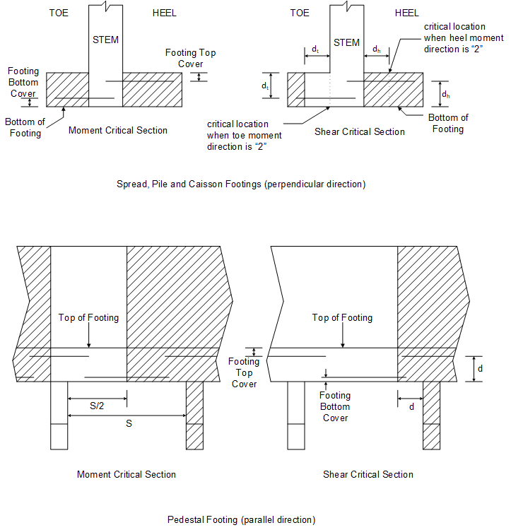
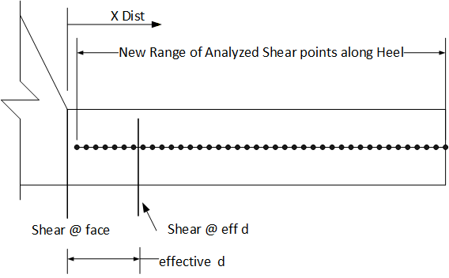
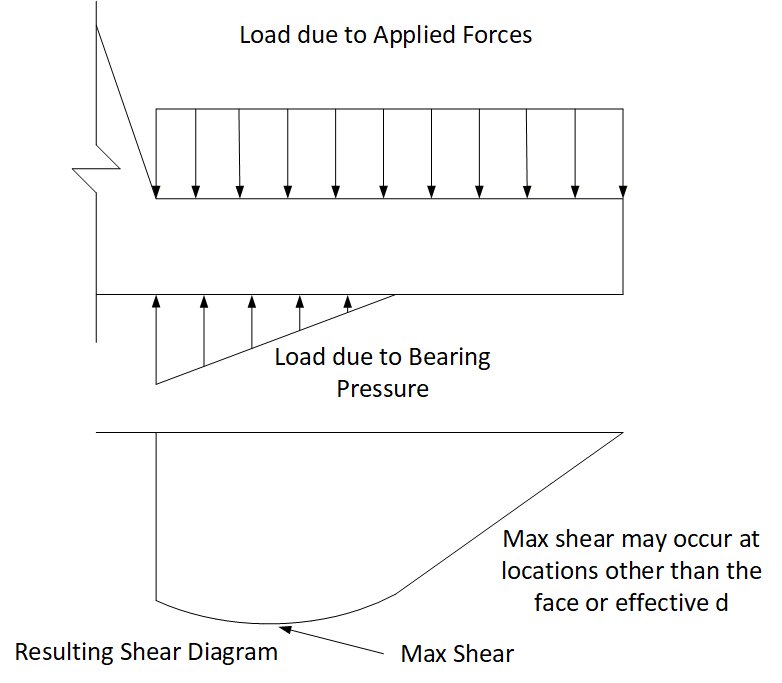
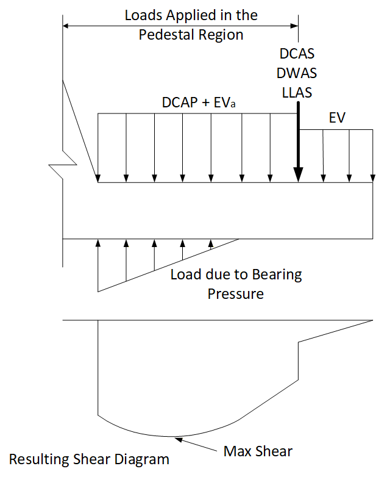
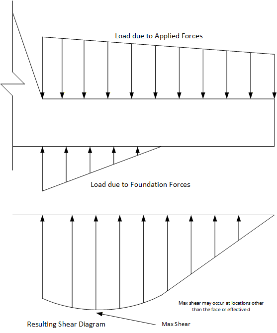
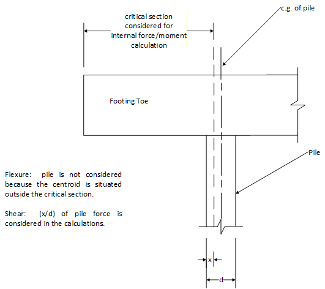
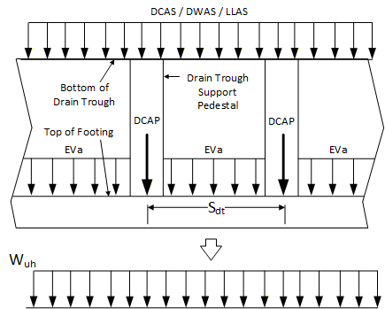
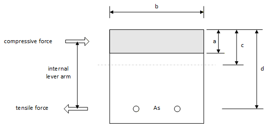
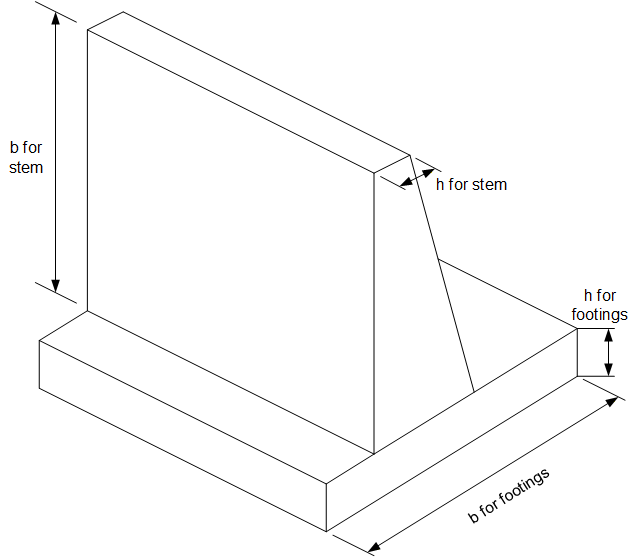

## 3.5 &emsp; Footing

### Structural Analysis

> Each footing type is checked for flexure and shear. The critical location and direction within the footing depends on the footing type as shown in Figure 3.5.1-1. Spread footings are analyzed in the perpendicular direction only. Pile footings are analyzed in both the perpendicular and parallel directions. Pile/Caisson footings use typical sections at maximum moment location. Bar details are illustrated in Figure 5.22-1. The user should ensure that the cover for the bottom reinforcement is sufficient to accommodate the pile/caisson embedment when applicable. Pedestal footings are analyzed in the parallel direction only (see Figure 2.1-1) because the footing and pedestal are assumed to be made integral using transverse shear keys and dowels as per DM-4 Section 10.6.5.2P. The critical location for shear may vary depending on the direction of the applied moment. The following sections identify the idiosyncrasies of each footing type.
>
> Loads from the service limit state are used to evaluate the moment that will determine the stresses in the reinforcement for the crack control check. Loads from all limit states are used to evaluate the maximum moment that must be resisted by the section.
>
> A separate section identifies how the stress in the rebar is evaluated under the service limit state. This generic description can be applied to all singly reinforced sections where the applied axial load is zero.
>
> The Moment direction within the footing is used to determine the critical shear locations in the footing as well as where the controlling moment used for perpendicular reinforcement analysis originates. For a Condition ”1” moment direction the moment induces tension in the bottom perpendicular reinforcement within the toe and tension in the top perpendicular reinforcement within the heel. For a Condition “2” moment direction the moment induces tension within the top perpendicular reinforcement for the toe and tension within the bottom perpendicular reinforcement within the heel.



**Figure 3.5.1-1 Critical Location for Footing Analysis**

#### Spread Footing

> The internal moment and shears are evaluated at the critical locations as shown in Figure 3.5.1-1. The moment at the toe critical location is assumed to create a tensile stress at the bottom face of the footing and is referred to as Condition “1”. The moment at the heel critical location is assumed to create tension at the top face of the footing also referred to as Condition “1”. The critical sections for flexure are always situated at the face of the stem. The toe critical shear location is typically situated at a distance ‘d’ from the face of the front stem. If the toe moment direction is Condition “2” , the shear is evaluated at the front face of the stem. The heel critical shear location is typically situated at the back face of the stem, or if the heel moment direction is condition “2”, the critical shear location is situated at a distance ‘d’ from the back face of the stem. In addition to these critical heel shear locations, the heel shear is calculated at fifty points along the heel projection to detect where the maximum shear is located. Below is a diagram showing the 50 analysis locations.



**Figure 3.5.1-2 Heel Shear Analysis Points Locations**

> The internal forces are determined by examining the loads applied to the free-body diagrams of the toe and heel sections. The internal moment and forces are evaluated by considering the net effects of the applied loads (directly above the toe or heel) and the actual bearing pressure below the footing. For abutments with Type 4 Approach Slabs, the applied loads also include the loading due to the approach slab and the drain trough and drain trough pedestals; soil vertical loads vary depending upon whether the section is between approach slab pedestals, EV<sub>a</sub>, or between the approach slab pedestal end and the end of the heel, EV.
>
> The bearing pressure distribution under the footing is determined by applying the overturning moment and vertical force to the footing. This pressure distribution is not the same as that considered for the bearing capacity check, and will always be triangular or trapezoidal in shape. The following is a diagram showing a typical soil pressure distribution including applied loads and shear diagram.



**Figure 3.5.1-3 Spread Footing Heel - Applied Load and Shear Diagram (Not Type 4 Approach Slab)**



**Figure 3.5.1-4 Spread Footing Heel - Applied Load and Shear Diagram (Abutments with Type 4 Approach Slab)**

#### Pile Footings

> For a pile footing analysis, axial pile loads are compared against the axial pile resistance given by the user. Axial pile loads must be compressive; an exception is made for the Extreme Event I limit state (earthquake). The tensile pile resistance may be specified by the user (CAI and PIL commands); it is only applicable for the Extreme Event I limit state.
>
> The pile or caisson footing is analyzed in the perpendicular and parallel directions.

##### Perpendicular Direction

The analysis of loads in the perpendicular direction of the pile footing is similar to that of the spread footing except that the pile forces are used in lieu of the actual soil pressure. Internal moments and shear are evaluated for strength and serviceability checks.

The internal forces are determined by computing the net effects of the loads applied to the free-body diagrams of the toe and heel critical sections. Applied loads include footing weight, soil loads and surcharges, resisted by buoyancy and loads from contributing piles determines if the pile moment will be considered in the capacity. For abutments with Type 4 Approach Slabs, applied footing loads also include the loading due to the approach slab and the drain trough and drain trough pedestals. Soil vertical loads vary depending upon whether the section is between approach slab pedestals, EVa, or between the approach slab pedestal end and the end of heel, Ev. The shear force is proportioned according to the area of the pile on either side of the critical location. In addition to the critical heel shear locations, the heel shear is calculated at fifty points along the heel projection to detect where the maximum shear is located. The following is a diagram showing the typical pile reactions including applied loads and the shear diagram.


**Figure 3.5.1-5 Pile Footing Heel - Applied Load and Shear Diagram (Not Type 4 Approach Slab)**



**Figure 3.5.1-6 Pile Footing Heel - Applied Load and Shear Diagram (Type 4 Approach Slab)**

For moment calculations, a pile contributes when its centroid falls within the free-body diagram. If the moment critical section intersects a pile, but the pile’s centroid falls outside the critical section, the pile does not contribute to the internal moment, as illustrated in Figure 3.5.1-7.



**Figure 3.5.1-7 Contribution of Pile to Moment and Force Calculations**

For shear calculations, a pile contributes as a percentage of that portion that falls within the free body diagram. For example, if the shear critical section intersects a pile, the contributing force is computed as a percentage of the dimension that falls within the free body diagram, as illustrated in Figure 3.5.1-7.

##### Parallel Direction

Parallel moments for the pile footing are computed using the maximum vertical load on the footing and assume that only 50% bending occurs in the longitudinal direction. A pseudo uniform load (Wu) is derived by dividing the maximum vertical load (VLF) by the footing width (B). The parallel moment (M) is then computed based on the pseudo uniform load (Wu) and the maximum pile spacing (S<sub>p</sub>), as shown in the following equations:

``` math
M = \ \frac{1}{2}\left( \frac{WuS_{p}^{2}}{10} \right)
```

where:

``` math
Wu = \ \frac{VLF}{B}
```

Analysis of loads over the heel in pile footings in the parallel direction are computed as follows for abutments with Type 4 Approach Slabs.



**Figure 3.5.1-8 Pile Footing Parallel Loading Type 4 Approach Slabs**

The total load over the heel that is distributed between two drain trough pedestals is computed by summing the DCAP, DCAS, DWAS, LLAS loads and EV load between two pedestals and then dividing by Sdt, the drain trough pedestal spacing, to compute the uniform load W<sub>uh</sub>. The W<sub>uh</sub> load over the heel is then added to the other vertical footing loads to compute a total VLF for the footing design section, which is used to compute the moment in the parallel direction.

This parallel moment is used in the analysis check of the top and bottom parallel reinforcement. The maximum vertical force is used for the strength limit states check. The maximum vertical force from the service limit state is used to evaluate the moment for the serviceability (crack control) checks.

#### Pedestal Footings

Pedestal footings are checked for: the relative values of the vertical and horizontal forces; the bearing pressure under the footing; the location of the footing resultant force; the flexural capacity of the footing (parallel direction); the shear capacity (parallel direction) of the footing; the bearing capacity under the pedestal; and the serviceability of reinforcement (crack control). Pedestal footing reinforcement is not analyzed in the perpendicular direction (toe and heel locations) because the footing and pedestal are assumed to be made integral using transverse shear keys and dowels as per DM-4 Section 10.6.5.2P. The critical locations are shown in Figure 3.5.1-1. Each item is described in more detail under a separate sub-section.

##### Footing Flexural Loads (parallel direction)

The applied flexural loads of the footing are evaluated in the parallel direction only. The applied moments are computed assuming that a uniform distributed load is applied over a continuous span structure. The uniform load is computed for two situations, namely: strength (maximum) and service conditions. The uniform load is determined by dividing the applicable vertical force (VLF) by the footing width (B) as shown in the equations below:


Where: VLF = the maximum vertical force from “strength limit state combinations”.


Where: VLF = the maximum vertical force from service limit state combinations.

For abutments with Type 4 Approach Slabs, the uniform loads udl and sudl are derived by distributing the DC<sub>AP</sub>, DC<sub>AS</sub>, DW<sub>AS</sub>, LL<sub>AS</sub>, and EV loads uniformly over the top surface of the footing heel as documented in Section 3.5.1.2.2.

The moment between the pedestals is used in the computations involving the bottom steel in the footing. The maximum moment between pedestals is:


The service moment between pedestals is:


The maximum moments over the pedestals are used in the computations of the top steel in the footing.

The maximum moment over the pedestal is:


The service moment over pedestals is:

``` math
a_{mos} = sudl\frac{s^{2}}{10}
```

For a design run, the flexural reinforcement required (as described in Section 3.5.2.2) in the parallel direction is evaluated using $`a_{mo}`$ and $`a_{mb}`$. The flexural reinforcement oriented in the perpendicular direction is not considered by the program.

For a design run, the moment capacity of the section is evaluated using the procedure described in Section 3.5.2.1 The capacity is compared to the applied moments $`a_{mo}`$ and $`a_{mb}`$.

The service moments, $`a_{mbs}`$ and $`a_{mos}`$, are used to compute the service load stresses as described in Section 3.5.1.4.

##### Shear Loads (parallel direction)

The maximum applied shear force is computed at a distance ‘d’ from the face of the pedestal. The following equation is used:


The shear capacity of the footing section is evaluated as described in Section 3.5.2.9 and compared to vped computed above.

#### Service Load Stresses

This section describes how the stress in the rebar is evaluated. It can be applied to all singly reinforced sections experiencing flexural loads only, i.e., both toe and heel critical sections and any point in the parallel direction.

The program will compute the stress at the extreme tensile fiber of the cross section. The stress is computed using gross section properties. The following equations are used:


where: 


The axial load is assumed to be compressive. In footing sections, the axial load is zero. Compressive stresses are negative by the program’s definition. The rupture stress is defined as follows for lightweight concrete with f'c \<= 10 ksi and for normal weight concrete with f'c \<= 15 ksi:

$`f_{r} = 0.24\ \lambda\ \sqrt{{f'}_{c}}`$ (f’<sub>c</sub> in ksi) LRFD Specifications Section 5.4.2.6

> Where: λ = concrete density modification factor (LRFD Specifications Section 5.4.2.8)
>
> If the stress is compressive or the tensile stress is less than 80% of the rupture stress, the program sets the applied steel stress, f<sub>s</sub>, to zero.
>
> The actual stress is based on the reinforced concrete theory based on a cracked section under service limit states. The actual stress f<sub>sact</sub> is computed as follows:


> where: 


> The solution is obtained by solving for the neutral axis depth such that the tensile force is equal to the compressive force and the strain compatibility is maintained.

##### Modulus of Elasticity and Modular Ratio

The program computes the concrete elastic modulus, E<sub>C</sub>, based on the Concrete Unit Weight for E (w<sub>C</sub>; parameter 13 of the MAT command) and the concrete strength input by the user (f'<sub>C</sub>; parameters 1, 2, and 3 of the MAT command). The modular ratio, n, is then calculated as the ratio of the steel elastic modulus, E<sub>S</sub>, to E<sub>C</sub>.

The program assumes that concrete is normal weight when it has a w<sub>C</sub> greater than or equal to 0.135 kcf. Lightweight concrete has a w<sub>C</sub> less than 0.135 kcf.

Several steps are followed for the determination of the concrete elastic modulus (E<sub>c</sub>) and the modular ratio (n) used by the program. In all of these steps, the steel elastic modulus (E<sub>S</sub>) is assumed to be equal to 29,000 ksi.

1\. DM-4 Sections 5.4.2.1 and 5.4.2.4 specify values for n and E<sub>C</sub> based on specific f'<sub>c</sub> and w<sub>C</sub> values. The concrete densities are specified as either normal weight, with a density of 0.145 kcf, or lightweight, with a density of 0.110 kcf. If the user enters a w<sub>C</sub> value of exactly 0.145 kcf or 0.110 kcf, along with an f'<sub>C</sub> value of exactly 4.0, 3.5, 3.0, or 2.0 ksi, the E<sub>C</sub> and n values will be set to the values shown in DM-4 Sections 5.4.2.1 and 5.4.2.4.

2\. If the user enters a w<sub>C</sub> value of exactly 0.145 kcf or 0.110 kcf, along with an f'<sub>C</sub> value between 4.0 ksi and 2.0 ksi (and not 4.0, 3.5, 3.0, or 2.0 ksi), the E<sub>C</sub> and n values will be interpolated between the values shown in DM-4 Sections 5.4.2.1 and 5.4.2.4. The E<sub>C</sub> value will be rounded to the nearest 100 ksi, and n will be rounded to the nearest integer value.

3\. If the user enters a w<sub>C</sub> value of exactly 0.145 kcf, along with an f'<sub>C</sub> value greater than 4.0 ksi and less than or equal to 10.0 ksi, the E<sub>C</sub> value will be calculated with LRFD Specifications Equation C5.4.2.4-2:

``` math
E_{c} = 33,000w_{c}^{1.5}\sqrt{f_{c}'}
```

> where: E<sub>C</sub> = Concrete elastic modulus
>
> w<sub>C</sub> = Concrete density for Ec
>
> f'<sub>C</sub> = Compressive strength of concrete

The E<sub>C</sub> value will be rounded to the nearest 100 ksi. The rounded E<sub>C</sub> value is then used to calculate n, which will be rounded to the nearest integer value.

4\. If the user enters a w<sub>C</sub> value of exactly 0.145 kcf, along with an f'<sub>C</sub> value greater than 10.0 ksi, the E<sub>C</sub> value will be calculated with LRFD Specifications Equation 5.4.2.4-1:

``` math
E_{c} = 120,000K_{1}w_{c}^{2.0}\left( f_{c}' \right)^{0.33}
```

> where: E<sub>C</sub> = Concrete elastic modulus
>
> K<sub>1</sub> = Correction factor for source of aggregate. BXLRFD uses a value of 1.0.
>
> w<sub>C</sub> = Concrete density for E<sub>C</sub>
>
> f'<sub>C</sub> = Compressive strength of concrete

The E<sub>C</sub> value will be rounded to the nearest 100 ksi. The rounded E<sub>C</sub> value is then used to calculate n, which will be rounded to the nearest integer value.

5\. If the user enters a w<sub>C</sub> value of exactly 0.110 kcf, along with an f'<sub>C</sub> value greater than 4.0 ksi, the E<sub>C</sub> value will be calculated with LRFD Specifications Equation 5.4.2.4-1, shown in step 4.

6\. If the user enters a w<sub>C</sub> value other than 0.110 kcf or 0.145 kcf, along with any f'<sub>C</sub> value, the E<sub>C</sub> value will be calculated with LRFD Specifications Equation 5.4.2.4-1 shown in step 4.

### Specification Checking

A given section is checked for flexural strength, crack control (serviceability) and shear. The capacity is based on a section that has a unit width and is considered to be singly reinforced. The reinforcement is assumed to be situated in the tensile zone. Perpendicular and parallel bar details are illustrated in Figure 5.22-1. The program does not check if the bottom reinforcement interferes with the piles or caissons. Hence the user should provide an adequate cover in such circumstances.

The flexural strength considers the minimum area of steel and bar spacing. For design problems, the flexural strength check evaluates the area of reinforcement required to resist the applied moment, then, an appropriate spacing value is determined for each bar size. For analysis problems, the flexural strength check evaluates the resisting moment based on the area of reinforcement specified by the user. The resisting moment is compared to the applied moment. In the pile footing, the flexural reinforcement is placed in both the perpendicular and parallel directions. Hence the reinforcement is checked in both directions.

The crack control check considers the stress in the reinforcement under service limit states. Bar spacing requirements are also considered. For design problems, the program may decrease the bar spacing required for flexural strength to satisfy the crack control specifications. This would result in increasing the area of reinforcement within the section.

The shear check ensures that the thickness of the section is adequate to resist the applied shear. Shear reinforcement is not considered. For design problems, the section thickness will be increased incrementally if the shear check fails.

The following sub-sections describe the details of each type of check.

#### Strength Check – Analysis

> The user may specify the reinforcement in terms of bars and spacings (BAR and SPA commands) or in terms of developed area of reinforcement (ARE command). If the bar-and-spacing option is used, the development length of the bar is evaluated to determine the area of developed reinforcement. There are three cases that may apply:

1.  If the actual length available to develop a given bar, l<sub>bact</sub>, is greater than or equal to the development length, l<sub>d</sub>, all of the reinforcement is considered to be fully developed.

> 2\. If l<sub>bact</sub> over l<sub>d</sub> ratio is less than 0.8(l<sub>d</sub>), none of the reinforcement is considered to be developed.

3.  If l<sub>bact</sub> over l<sub>d</sub> ratio is greater than 0.8(l<sub>d</sub>) and less than l<sub>d</sub>, then none of the area of reinforcement is considered to be developed and an informative message containing a spacing that would develop the bar is shown. The spacing is calculated with the following equation


Where: s<sub>new</sub> = new suggested spacing

s<sub>orig</sub> = original bar spacing

l<sub>d</sub> = Development length of bar

l<sub>bact</sub> = Available space for bar to develop in the component

> The procedure for evaluating the development length is described in Section 3.5.2.3.
>
> The moment capacity, φM<sub>n</sub>, is evaluated given the developed area of reinforcement and 𝜙 computed as shown in Section 3.5.2.5. The value of 𝜙 is initially set equal to the 𝜙 limit and the stress in the reinforcement steel, f<sub>s</sub>, is assumed to be equal to the specified minimum yield strength, f<sub>y</sub>.
>
> The net tensile strain and the stress in the reinforcement is computed from the following:
>
> ``` math
> c = \ \frac{A_{s}\ f_{s}}{0.85\ f_{c}'\ \beta_{1}\ b}
> ```
>
> $`\varepsilon_{t} = \ \frac{0.003\ (d - c)}{c}`$ LRFD Specifications Equation C5.6.2.1-1
>
> ``` math
> f_{s} = min(\varepsilon_{t} \cdot E_{s},\ f_{y})
> ```

If the mild steel stress, f<sub>s</sub>, is less than the yield strength, f<sub>y</sub>, then the initial assumption was incorrect and the nominal flexural capacity is determined based on conditions of equilibrium and strain compatibility. The resistance factor 𝜙 is computed with the net tensile strain using the equations shown in Section 3.5.2.5. The equation to compute the moment capacity derived below is based on a generic cross section of unit width shown in Figure 3.5.2-1.

From internal equilibrium (Tension = Compression):

``` math
A_{s}f_{y} = 0.85f_{c}'ab
```

Nominal moment capacity (M<sub>n</sub>) is equal to tensile force multiplied by the internal lever arm:

``` math
M_{n} = A_{s}f_{y}\left( d - \ \frac{a}{2} \right)
```

Solving the internal equilibrium equation for a and substituting a in equation for nominal moment capacity results in the following:

``` math
M_{n} = A_{s}f_{y}\left( d - \frac{A_{s}f_{y}}{2(0.85)f_{c}'b} \right)
```

The factored resistance moment is compared to the factored applied moment.



**Figure 3.5.2-1 Singly Reinforced Section**

Finally, the factored flexural capacity is computed by multiplying the nominal flexural capacity by 𝜙. If the computed 𝜙 factor is less than 0.90, then the process is repeated with 𝜙 assumed to be 0.75 and a second moment capacity is computed. Using the second moment capacity a new factored flexural capacity is computed. If the second moment capacity is less than the applied factored moment then the cross section is considered inadequate; otherwise, the 𝜙 factor is iterated until the assumed 𝜙 factor is equal to the computed 𝜙 factor. For analysis, the inadequate resistance is reported.

#### Strength Check – Design 

When the program is designing reinforcement, the development length is checked to ensure that the selected bar size and spacing will be able to develop within the actual geometry of the concrete component. If the bar does not develop, the program will then reduce the spacing by multiplying by a ratio of the actual length available to the calculated development length, not less than 80%, and then check the development again. If the reduced spacing requires a development length that is greater than the actual geometry available then the program will indicate that the bar cannot be developed.

For perpendicular footing bars, if the Hooked Footing Bars parameter on the SPD card is set to “Y”, the program will check if hooked bars would work when a straight bar does not. In this case the program will then calculate the hooked development length of bar at its original spacing. If the hooked bar cannot be developed in the actual geometry, the program will then reduce the spacing by a ratio of the actual length available to the development length, not less than 80%, and then recalculate the development length. If the reduced spacing requires a development length that is greater than the geometry available then the program will indicate that the bar cannot be developed.

The method of reducing the spacing is shown below with accompanying equations:

When the L<sub>dbar</sub> \>L<sub>dact</sub>

L<sub>dratio</sub> = 

s<sub>new</sub> = s<sub>orig</sub> \*L<sub>dratio</sub>

> Where: L<sub>dbar</sub> = Development length of a bar
>
> L<sub>dact</sub> = Available space for bar to develop in the component
>
> L<sub>dratio</sub> = Ratio of available length to develop versus the required bar development length
>
> s<sub>orig</sub> = Selected bar spacing
>
> s<sub>new</sub> = New reduced bar spacing

The 0.8 in the above equation is the limit on the spacing reduction. For example, if a 9 inch spacing does not work, then the spacing is reduced but to no less than 7.2 inches which rounds to 7 inches. This technique allows the program to inform the user of the spacing required for the selected bar that would allow the bar to develop within the space available.

The procedure for evaluating the development length is described in Section 3.5.2.3.

For a design run when the required area of reinforcement, A<sub>s</sub>, can be developed to resist applied moment, M<sub>u</sub>, is calculated by solving the following quadratic equation:


The area of reinforcement calculated using the above equation is based on a theory of singly reinforced rectangular concrete section.

The derivation of the above equation is shown below: Refer to Figure 3.5.2-1.

From internal equilibrium (Tension = Compression)


From external equilibrium:


Solve for ‘a’ above:


Simplifying the above equation results in the quadratic equation shown above.

For a design run the program assumes 𝜙 to be 0.90 and solves the area of steel for all limit states, all flexure maximum effect cases, and all points-of-interest.

The nominal moment resistance is computed with the assumption that f<sub>s</sub> is equal to f<sub>y</sub> in the following equations:

> 
> ``` math
> c = \ \frac{A_{s}\ f_{s}}{0.85\ f_{c}'\ \beta_{1}\ b}
> ```
>
> ``` math
> a = \ \beta_{1}\ c
> ```
>
> ``` math
> M_{n} = \ A_{s}\ f_{s}\ \left( d - \frac{a}{2} \right)
> ```

where: c = distance from the extreme compression fiber to the neutral axis (in)

As = area of tension reinforcement (in2)

fs = stress in mild steel tension reinforcement at nominal flexural resistance (ksi)

𝑓𝑐′ = Concrete design strength (ksi)

𝛽1 = ratio of the depth of the equivalent uniformly stressed compression zone to the depth of the actual compression zone

b = width of the compression face of the member (in)

a = depth of equivalent rectangular stress block (in)

Mn = nominal flexural resistance (in-kips)

d = distance from compression face to centroid of tension reinforcement (in)

> The net tensile strain and the stress in the reinforcement is computed from the following:

$`ɛ_{t} = \ 0.003\ \left( \frac{d_{s}}{c} - 1 \right)`$

$`f_{s} = \ min\left( ɛ_{t} \cdot E_{s},\ {\ f}_{y} \right)`$

where: 𝜀<sub>𝑡</sub> = net tensile strain in extreme tension steel at nominal resistance (in/in)

ds = distance from extreme compression fiber to the centroid of the nonprestressed tensile reinforcement (in)

Es = modulus of elasticity of reinforcing bars (ksi)

fy = specified minimum yield strength of reinforcing bars (ksi)

If the mild steel stress, *f<sub>s</sub>*, is less than the yield strength, *f<sub>y</sub>*, then the initial assumption was incorrect and the nominal flexural resistance is determined based on conditions of equilibrium and strain compatibility.

The resistance factor 𝜙 is computed with the net tensile strain using the following equation:

``` math
0.75\  \leq \ \phi = 0.75 + \frac{0.15\ (ɛ_{t} - \ ɛ_{cl})}{(ɛ_{tl} - \ ɛ_{cl})}\  \leq \ 0.9
```

where: 𝜀<sub>cl</sub> = compression-controlled strain limit, 0.002

𝜀<sub>tl</sub> = tension-controlled strain limit, 0.005 (for f<sub>y</sub> ≤ 75.0 ksi)

𝜀<sub>𝑡l</sub> = 0.005 + $`\frac{(f_{y} - 75.0)(0.003)}{25.0}`$ (for 75.0 ksi \< f<sub>y</sub> ≤ 100.0 ksi)

Finally, the factored flexural resistance is computed by multiplying nominal flexural resistance by 𝜙. If the computed 𝜙 factor is less than 0.90, then the process is repeated with 𝜙 assumed to be 0.75 and a second steel area is computed from the quadratic equation. Using the second area a new factored flexural resistance is computed. If the new factored flexural resistance is less than the applied factored moment then the cross section is considered inadequate and the section depth is incremented and the process is repeated. Otherwise, an iterative procedure is used to find an area of steel that results in a factored flexural resistance that equals (within a tolerance) the applied factored moment.

The program will use the smallest positive root as the solution. If both roots are negative, the area cannot be evaluated because of the incompatible relationship between the applied moment, material strengths and the given geometry of the section, i.e., stronger materials properties and/or a deeper section are required.

#### Tension Development Length

The modified tension development length of a reinforcing bar depends on several factors including: bar size; geometry (straight or hooked); function and the user specified correction factor (see MRD command, Chapter 5).

<u>Straight Bars</u>

The modified tension development length (ℓ<sub>d</sub>) is calculated from the basic development length (ℓ<sub>db</sub>) by adjusting for correction factors (λ<sub>rl</sub>, λ<sub>cf</sub>, λ<sub>rc</sub>, λ<sub>er</sub>, and λ), which are described further in the next sub-section. The correction factors consider the location of the reinforcement, epoxy coating on the bar, confinement of the reinforcement, excess reinforcement and a value specified by the user.

> 
> ``` math
> \mathcal{l}_{d} = max\begin{pmatrix}
> 12.0" \\
> \mathcal{l}_{db}*\left( \frac{\lambda_{rl}\ \lambda_{cf}\ \lambda_{rc}\ \lambda_{er}}{\lambda} \right)*MRD\ Factor
> \end{pmatrix}
> ```
>
> $`\mathcal{l}_{db} = 2.4\ d_{b}\ \left( \frac{f_{y}}{\sqrt{{f'}_{c}}} \right)`$ LRFD Specifications Equation 5.10.8.2.1a-2
>
> Where: ℓ<sub>d</sub> = modified bar development length (in) (LRFD Specifications Equation 5.10.8.2.1a-1)
>
> ℓ<sub>db</sub> = basic development length required for a given bar (in)
>
> λ<sub>rl</sub> = reinforcement location factor
>
> λ<sub>cf</sub> = coating factor
>
> λ<sub>rc</sub> = reinforcement confinement factor
>
> λ<sub>er</sub> = excess reinforcement factor
>
> λ = concrete density modification factor (LRFD Specifications Section 5.4.2.8)
>
> d<sub>b</sub> = nominal diameter of reinforcing bar or wire (in)
>
> f<sub>y</sub> = specified minimum yield strength of reinforcement (ksi)
>
> f’<sub>c</sub> = compressive strength of concrete (ksi)
>
> MRD Factor = User input development correction on the MRD Command

Note: The concrete compressive strength, f'<sub>c</sub>, and steel yield stresses, f<sub>y</sub>, are specified in ksi, the bar diameter, d<sub>b</sub>, is specified in inches, and the development length has the units of inches.

<u>Hooked Bars</u>

The following equations apply for computing the modified development length (ℓ<sub>dh</sub>) for a hooked bar. The basic development length is adjusted by the correction factors (λ<sub>rc</sub>, λ<sub>cw</sub>, λ<sub>er</sub>, and λ), which are described further in the next sub-section. The basic development length considers the yield strength of the reinforcement and concrete, while the correction factors consider the confinement of the bar, epoxy coating on the bar, and the area of reinforcement.

> 
> ``` math
> \mathcal{l}_{dh} = max\begin{pmatrix}
> 8.0*d_{b} \\
> 6.0" \\
> \mathcal{l}_{hb}*\left( \frac{\lambda_{rc}\lambda_{cw}\lambda_{er}}{\lambda} \right)*MRD\ Factor
> \end{pmatrix}
> ```
>
> $`\mathcal{l}_{hb} = \ \frac{38.0\ d_{b}}{60.0}\ \left( \frac{f_{y}}{\sqrt{{f'}_{c}}} \right)`$ LRFD Specifications Equation 5.10.8.2.4a-2
>
> Where: ℓ<sub>dh</sub> = modified hooked bar development length (in) (LRFD Specifications Equation 5.10.8.2.4a-1)
>
> ℓ<sub>hb</sub> = basic hooked development length required for a given bar (in)
>
> λ<sub>rc</sub> = reinforcement confinement factor
>
> λ<sub>cw</sub> = coating factor
>
> λ<sub>er</sub> = excess reinforcement factor
>
> λ = concrete density modification factor (LRFD Specifications Section 5.4.2.8)
>
> d<sub>b</sub> = nominal diameter of reinforcing bar or wire (in)
>
> f<sub>y</sub> = specified minimum yield strength of reinforcement (ksi)
>
> f’<sub>c</sub> = compressive strength of concrete
>
> MRD Factor = User input development correction on the MRD Command

#### Development Length Correction Factors

The basic development length for straight bars is multiplied by the following factors (LRFD Specifications Sections 5.10.8.2.1b and 5.10.8.2.1c):

- λ<sub>rl</sub>\*, reinforcement location factor is 1.3 for horizontal reinforcement footing bars, placed such that more than 12.0 in. of fresh concrete is cast below the reinforcement, otherwise 1.0, including for vertical stem and backwall reinforcement.

- λ<sub>rc</sub>, reinforcement confinement factor is defined as follows:

> 
> ``` math
> 0.4 \leq \lambda_{rc} \leq 1.0
> ```
>
> In which:
>
> ``` math
> \lambda_{rc} = \frac{d_{b}}{c_{b} + k_{tr}}
> ```
>
> ``` math
> k_{tr} = 40\frac{A_{tr}}{(sn)}
> ```
>
> where:
>
> $`c_{b}`$ = the smaller of the distance from center of bar or wire being developed to the nearest concrete surface and one-half the center-to-center spacing of the bars or wires being developed (in).
>
> $`k_{tr}`$ = transverse reinforcement index
>
> $`A_{tr}`$ = total cross-sectional area of all transverse reinforcement which is within the spacing $`s`$ and which crosses the potential plane of splitting through the reinforcement being developed (in.<sup>2</sup>)
>
> Note: $`A_{tr}`$ is conservatively taken as zero which results in $`k_{tr}`$ also being zero and reduces the the reinforcement confinement factor equation to $`\frac{d_{b}}{c_{b}}`$ with the limits of 0.4 and 1.0.
>
> $`s`$ = maximum center-to-center spacing of transverse reinforcement within $`l_{d}`$ (in.)
>
> $`n`$ = number of bars or wires developed along plane of splitting

- λ<sub>cf</sub>\*, coating factor is 1.5 for epoxy-coated bars with less than 3d<sub>b</sub> cover or with clear spacing between bars less than 6d<sub>b</sub>, and 1.2 for other epoxy-coated bars, and 1.0 for plain bars.

<!-- -->

- λ<sub>er</sub>, excess reinforcement factor adjusts the length by the ratio:

``` math
\lambda_{er} = \frac{\left( A_{s}\ required \right)}{\left( A_{s}_{}\ provided \right)}
```

\* The product of λ<sub>rl</sub> x λ<sub>cf</sub> need not be taken greater than 1.7.

The basic development length for hooked bars is multiplied by the following factors (LRFD Specifications Section 5.10.8.2.4b):

- λ<sub>rc</sub>, reinforcement confinement factor for \#11 bars and smaller is 0.8 and 1.0 for other bars.

- λ<sub>cw</sub>, coating factor is 1.2 if epoxy coated and 1.0 for plain

- λ<sub>er</sub>, excess reinforcement factor adjusts the length by the ratio:

``` math
\lambda_{er} = \frac{\left( A_{s}\ required \right)}{\left( A_{s}_{}\ \ provided \right)}
```

#### Resistance Phi Factor

The relationships that apply are based on the section illustrated in Figure 3.5.2-1 and the equations shown below.

The current LRFD Specifications now reduces the phi factor based on the strain condition at the cross-section. A reduction in the phi factor for compression-controlled sections is used to compensate for decreased ductility in comparison to tension-controlled sections. The variant resistance phi factor is computed by the following equation:

> $`c = \frac{A_{s}\ f_{s}}{0.85\ f_{c}'\ \beta_{1}\ b}`$
>
> $`\varepsilon_{t} = \frac{0.003(d - c)}{c}`$ LRFD Specifications Figure C5.6.2.1-1
>
> The resistance factor 𝜙 is computed with the net tensile strain using LRFD Specifications Equation 5.5.4.2.1-2:
>
> ``` math
> 0.75\  \leq \ \varnothing\  = 0.75 + \ \frac{0.15(\varepsilon_{t} - \varepsilon_{cl})}{\varepsilon_{tl} - \varepsilon_{cl}}\  \leq 0.9
> ```

where: ε<sub>τ</sub> = net tensile strain in the extreme tension steel at nominal resistance (in./in.)

ε<sub>cl</sub> = compression-controlled strain limit in the extreme tension steel (in./in.)

ε<sub>tl</sub> = tension-controlled strain limit in the extreme tension steel (in./in.)

c = distance from the extreme compression fiber to neutral axis (in.)

d = distance from the extreme compression fiber to the centroid of the extreme tension steel (in.)

#### Spacing Requirements

The minimum clear distance between parallel bars in a layer for the serviceability check is the greatest of:

- 2.5 in. DM-4 Section 5.10.3.1.1

- 1.5 times the nominal bar diameter LRFD Specifications Section 5.10.3.1.1

- 1.5 times the maximum size of the coarse aggregate LRFD Specifications Section 5.10.3.1.1

> (entered on the MRD command)

The minimum bar spacing limit is the clear distance between bars plus the bar diameter. This check is performed for both design and analysis runs. If the reinforcement is entered as a developed area of reinforcement for an analysis run, the program will calculate a bar spacing based on the entered area of reinforcement and the entered maximum bar diameter. This calculated spacing will be used for spacing requirement checks.

The maximum spacing for a \#4 bar is:

$`S_{MAX} = min(1.5t,12\ in)`$ DM-4 Section 5.10.3.2 and

DM-4 Section 5.10.6.1P

The maximum spacing for bar sizes \#5 or larger is:

$`S_{MAX} = min(1.5t,18\ in)`$ DM-4 Section 5.10.3.2 and

DM-4 Section 5.10.6.1P

Where "*t*" is the structural thickness of the member.

#### Minimum Area of Reinforcement

> The minimum area of reinforcement that is required is determined by the following relationships:

##### Minimum Based on Temperature and Shrinkage Requirements

> (in<sup>2</sup>/ft) LRFD Specifications Equation 5.10.6-1

If A<sub>s1</sub> \< 0.11 Then

A<sub>s1</sub> = 0.11 in<sup>2</sup>/ft

If A<sub>s1</sub> \> 0.6 Then

A<sub>s1</sub> = 0.6 in<sup>2</sup>/ft

A<sub>s2</sub> = \#4’s @ 12 in = 0.2 in<sup>2</sup>/ft DM-4 Section 5.10.6.1P

*A<sub>s</sub> = MAX \[A<sub>s1</sub>, A<sub>s2</sub>\]*

Where:

h = least height of the component (in)

b = least width of the component (in)

ABLRFD sets the least width of the component equal to the height for backwall/stem or the width of the footing as illustrated in Figures 3.5.2-2 and 3.5.2-3.

The 0.12 in<sup>2</sup>/ft requirement from DM-4 Section 5.10.6 does not control over DM-4 Section 5.10.6.1P and is not considered by the ABLRFD program.




**Figure 3.5.2-2 Temperature and shrinkage dimension location RWL, AWB**

<span id="_Toc376871679" class="anchor"></span>Figure 3.5.2-3 Temperature and shrinkage dimension locations AT1, AT2

##### Minimum Based on Flexural Requirements

The strength limit state requirements (i.e. moment capacity related) are based on the ρ<sub>min</sub> criteria which evaluates the reinforcement ratio for a section that will resist an applied moment ( M<sub>app</sub> ) that is the lesser of 1.33 M<sub>u</sub> or M<sub>cr</sub> (DM-4 Section 5.6.3.3).

``` math
M_{cr} = \gamma_{3}\left( \gamma_{1}f_{r}S_{b} \right)
```

Where γ<sub>1</sub> = 1.6 for non prestressed concrete DM-4 Section 5.6.3.3

γ<sub>3</sub> = f<sub>y</sub>/f<sub>u</sub> DM-4 Section 5.6.3.3

> The value of ρ is obtained from the following equation:


> This equation is based on the singly reinforced section illustrated in Figure 3.5.2-1. It is based on the solution to the quadratic equation identified in Section 3.5.2.2.
>
> The cracking moment, M<sub>cr</sub>, referenced above, is the moment applied to the section that will produce the rupture stress of concrete at the extreme tension fiber of an uncracked section.

#### Serviceability Crack Control

The crack control is checked as per DM-4 Section 5.6.7 where the spacing of the main tensile reinforcement is checked against the result of LRFD Specifications Equation 5.6.7-1. For bottom perpendicular reinforcement (toe) the program subtracts 1 inch of cover to account for foundation unevenness when calculating the allowable crack control spacing.


Where γ<sub>e</sub> = 1.00 for Class 1 Exposure

0.75 for Class 2 Exposure

f<sub>ss</sub> = MIN( f<sub>s</sub> , 0.6\*f<sub>y</sub>)

β<sub>s</sub>

#### Shear 

The shear resistance of the section does not consider shear reinforcement. It is based on the strength of the concrete and the shear depth. The shear depth (d<sub>v</sub>) is a function of: the Whitney stress block depth (a); the effective depth (d); and the height (h) of the section as shown below:

 LRFD Specifications Section 5.7.2.8

The depth of the Whitney stress block, ‘a’, is calculated by evaluating the flexural capacity of the section as described in Section 3.5.2.1.

The shear capacity, V<sub>c</sub>, is evaluated by the following:

$`V_{c} = v_{fact}\ \beta\ b\ d_{v}\ \lambda\ \sqrt{{f'}_{c}}`$ LRFD Specifications Equation 5.7.3.3-3

Where: *v<sub>fact</sub> =* 0.0316

β *=* 2.0 LRFD Specifications Section 5.7.3.4.1

λ = concrete density modification factor (LRFD Specifications Section 5.4.2.8)

The maximum shear is considered from all of the limit state cases.

#### Punching Shear (Pile/Caisson Footings)

For both piles and caissons for design and analysis, the punching shear check begins by computing the depth of the Whitney stress block (see Section 3.5.2.1), based on the effective depth for the reinforcement in the top perpendicular direction of the footing. The shear depth is then computed using the equation in Section 3.5.2.9.

>  LRFD Specifications Section 5.7.2.8

Where: d = top perpendicular bar effective depth – pile/caisson embedment

h = footing thickness – pile/caisson embedment

A shear perimeter around the pile, b<sub>o</sub>, is then computed based on the pile cross sectional dimension and the shear depth, d<sub>v.</sub>

> *b<sub>o</sub> =* 2 *(a + d<sub>v</sub>) +* 2 *(b + d<sub>v</sub>)* for rectangular piles
>
> *b<sub>o</sub> = π (diam + d<sub>v</sub>)* for circular piles

A beta factor (b<sub>c</sub>) is then computed for rectangular piles by taking the bigger dimension and dividing it by the smaller dimension. The beta factor is 1 for circular piles. A punching shear factor is then computed using LRFD Specifications Equation 5.12.8.6.3-1 based on the beta factor:

*, but not greater than* 0.126

The punching shear resistance is computed using LRFD Specifications Equation 5.12.8.6.3-1 and compared against the maximum vertical pile load:

$`V_{pr} = \ \varphi\ f_{ps}\ \lambda\ \sqrt{{f'}_{c}\ }\ b_{o}\ d_{v}`$

Punching shear is checked for single piles only. Effects due to overlapping shear planes should be checked by the engineer if piles are closely spaced.

#### Punching Shear (Type 4 Approach Slab Pedestals)

For design and analysis, the punching shear check begins by computing the depth of the Whitney stress block (see Section 3.5.2.1), based on the effective depth for the reinforcement in the top perpendicular direction of the footing. The shear depth is then computed using LRFD Specifications Section 5.7.2.8:


Where: d = top perpendicular bar effective depth

h = footing thickness

A shear perimeter around the drain trough pedestal is then computed based on the drain trough length, x, and width, y, and the effective shear depth:

<figure>

<figcaption><p><span id="_Toc179015873" class="anchor"></span>Figure 3.5.2‑4 Punching Shear Perimeter Around Drain Trough Pedestal</p></figcaption>
</figure>

$`b_{o} = 2\ \left( \ x + 0.5d_{v} \right) + 2\ (\ y + d_{v})`$

If the distance between the end of heel and the end of the drain trough support pedestal, z, is less than 0.5d<sub>v</sub> then the punching shear perimeter is reduced:

$`b_{o} = 2\ (\ x + z) + y + d_{v}`$

A beta factor (b<sub>c</sub>) is then computed by taking the maximum of the drain trough pedestal length and the drain trough pedestal width and dividing it by the minimum of the drain trough pedestal length and the drain trough pedestal width. A punching shear factor is then computed using LRFD Specifications Equation 5.12.8.6.3-1 based on the beta factor:

, but not greater than 0.126

The punching shear resistance is computed using LRFD Specifications Equation 5.12.8.6.3-1 and compared against the maximum vertical loading transferred from the drain trough pedestal to the footing.

$`V_{pr} = \ \varphi\ f_{ps}\lambda\sqrt{{f'}_{c}}b_{o}\ d_{v}`$

### Design of a Footing Section

The algorithm that follows is for a footing on piles. Pile footings contain rebar in both the parallel and perpendicular directions. The reinforcement in the parallel direction is not considered in spread footings, and the reinforcement in the perpendicular direction (toe and heel locations) is not considered for pedestal footings because the footing and pedestal are assumed to be made integral using transverse shear keys and dowels as per DM-4 Section 10.6.5.2P. Perpendicular and parallel bar details are illustrated in Figure 5.22-1. The program does not check if the bottom reinforcement interferes with the piles or caissons. Hence, the user should provide an adequate cover in such circumstances.

The design algorithm evaluates the area of steel required based on the strength requirements first. Hence, the area of reinforcement in the toe, the heel and the parallel (top and bottom) direction is computed to resist the maximum moment in each direction (parallel and perpendicular). The area of steel cannot be less than that defined by the minimum reinforcement ratio.

For each bar size, the program computes the spacing required to satisfy the area of reinforcement required. The bar spacing is rounded down to the nearest user entered increment. For example, if the area of reinforcement required (per ft) is 1.1 in<sup>2</sup>, a \#8 bar should be spaced at (12.0 in. x 0.79 (in<sup>2</sup>/bar) / 1.1 (in<sup>2</sup>)) = 8.618 in. If the requested minimum spacing is 6 inches and the increment is 3 inches then this value is rounded to 6.0 inches since it is the closest value within the increment and it does not exceed the theoretical bar spacing. A \#9 bar would be spaced at 9.0 in (10.909 in. theoretical spacing). If the reported spacing during design runs is less than the User Requested Minimum Spacing or the LRFD Specifications spacing, the program will not report design values for the bar (See Chapter 7) and the spacing shown is the un-rounded design spacing shown for information purposes.

For each bar size and the corresponding spacing, the program then checks the serviceability requirements. These checks include:

- Minimum and maximum spacing requirements (Section 3.5.2.6); and,

- Allowable tensile stress in the rebar that incorporates crack width criteria (Section 3.5.2.8).

If the tensile stress exceeds the allowable stress, the bar spacing is reduced until a satisfactory solution has been obtained. If the required bar spacing violates the minimum spacing requirements, then that bar is rejected. If all the bar sizes are rejected, a solution cannot be obtained for the given footing configuration.

The footing configuration is considered acceptable if at least one bar size and its corresponding spacing satisfies the strength and serviceability requirements.

The program will compute the development length for each bar size as described in Section 3.5.2.3. The bar spacing may be further reduced to satisfy the development length criteria. This may occur for the larger bar sizes which require longer development lengths. For example, if the actual available length for developing a bar in the toe (toe projection - end cover) is shorter than the required development length, then the actual steel area provided may be increased by reducing the bar spacing in order to reduce the required development length as described in Section 3.5.2.4.

Development lengths can be computed for straight and hooked bars. Footing bars are assumed to be straight. Stem bars are assumed to be hooked in the footing, but straight in the stem.

Note that, reducing the spacing automatically satisfies the allowable tensile stress check (serviceability check).
