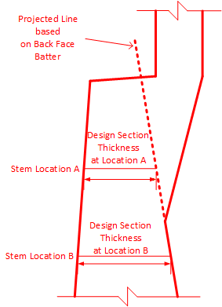
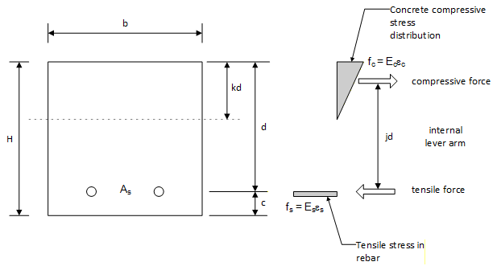
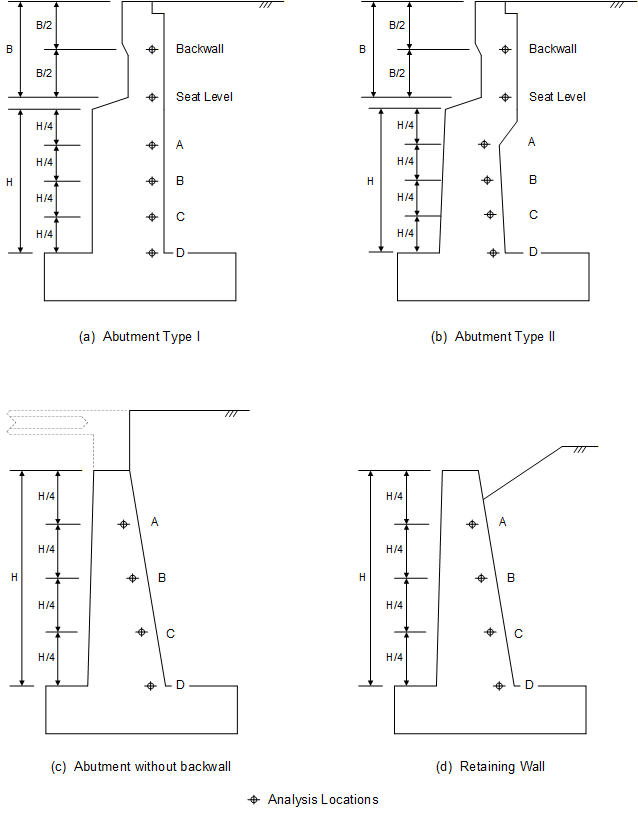
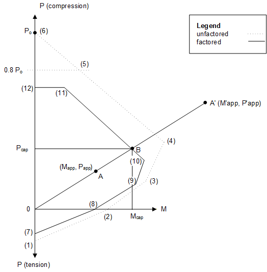
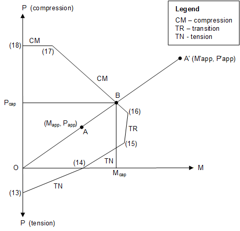
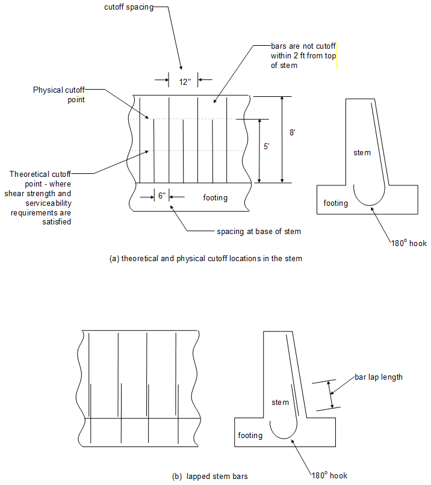
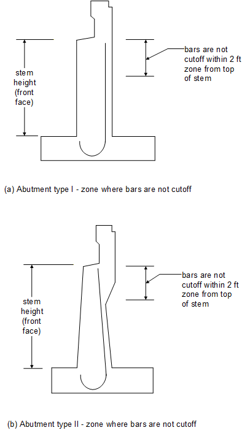
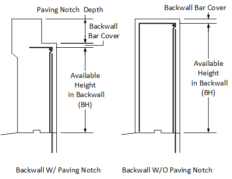

## 3.6 &emsp; Backwall and Stem

The backwall is checked at two locations, namely: the middle of backwall and the seat level. The stem is examined at the quarter point locations. These points are shown in Figure 3.6-1. The cross sections are considered to be singly reinforced. Only the back face reinforcement is considered in the calculations.

Each point is checked for shear, service load stress in the rebar and the strength capacity. The strength capacity calculations consider the effect of the moment-axial load interaction.

The “Structural Analysis” section that follows briefly explains how the shear force, axial load and moments are evaluated. The section primarily focuses on how the stress in the rebar is evaluated considering axial and flexural loads. The “Specification Checking” section refers to the description for the footing section since the checks are very similar. The section primarily focuses on how the capacity is evaluated when the moment and axial load interaction is considered.

Stem and backwall bars are situated at the back face of the section as illustrated (see vertical reinforcement) in Figure 5.22-1. Figures 5.27-1 and 5.28-1 illustrate variations of how the stem reinforcement can be specified.

For the Type II abutment the assumption is made that the rear face vertical reinforcement extends parallel to the stem back face batter, as shown in Figure 3.6-1, up to the bearing seat. When an analysis point is located above the stem notch, the thickness of the design section is limited to the horizontal distance between the front face of the stem and the projected line from the stem back face batter.. Figure 3.6-1 illustrates how the section thickness for stem analysis locations above the stem notch is determined.



**Figure 3.6-1 Type II Abutment Section Height at Stem Points of Analysis Above Stem Notch**

### Structural Analysis

The shear force, axial force and moment values at a given section are determined from a static analysis of the loads (horizontal and vertical) acting on the stem and backwall above the section under consideration. The calculation of the actual stress in the stem and backwall reinforcement is more complex than that in the footing because it considers the axial load. The procedure to compute that actual stress depends on the relative value (ratio) of the applied axial load (N) to the maximum axial load (P<sub>max</sub>), the applied moment (M) and the geometry of the section as shown below:


> If the ratio is less than 0.003, the section is considered to behave as a flexural member. Hence, the stress in the reinforcement, f<sub>s</sub>, is computed using the procedure described in Section 3.5.1.4 for the footing (i.e., the axial load is neglected).
>
> If the ratio is greater than 0.003 and less than or equal to 0.5, the solution is determined by iterating on the value of the concrete strain so that the equilibrium equations for the moment and axial values are satisfied. Refer to Figure 3.6.1-1 for the formulation of the equations that are checked and followed.



**Figure 3.6.1-1 Lateral Forces of Cross Section**



**Figure 3.6.1-2 Stem and Backwall Points of Analysis**

From internal equilibrium of axial load and strain compatibility:

> *N = C - T* (1)

 (2)

 (3)

> Where: *kd* = *depth to neutral axis from extreme compressive fiber*
>
> ε<sub>c</sub> = *strain in concrete at extreme compressive fiber*

ε<sub>s</sub> = *strain in tensile reinforcement*

*N* = *axial load*

*C* = *concrete compressive strength*

*T* = *tensile strength of reinforcement*

*A<sub>s</sub>* = *area of mild steel reinforcement*

> Substitute (2) and (3) into (1) and simplify for k to get:

 (4)

From strain compatibility:

 (5)

> From moment equilibrium: (6)

 (7)

> **Solution:** Initialize concrete strain ε<sub>c</sub> to 0.008, solve for k using equation (4), and check moment equilibrium (7). If M<sub>calc</sub> is not within 0.1% of M<sub>service</sub>, perform new calculations with revised strain.

The assumed concrete strain value is used to compute the neutral axis depth based on the equilibrium equation for the axial load (equation 4). The neutral axis depth and concrete strain are used to compute the internal moment of the section (equation 7). The moment is compared to the applied moment. If the comparison is not within an acceptable tolerance (0.1%), the concrete strain value is revised. The program will stop after 50 iterations if convergence has not occurred and print out an error message.

When the ratio is greater than 0.5, the program iterates on the depth of the neutral axis so that the equilibrium equations for the moment and axial values are satisfied. The formulation of the equations that are checked include:

From internal equilibrium of axial load and strain compatibility:

> *N = C -T* (1)
>
>  (2)
>
>  (3)
>
> Where: *kd* = *depth to neutral axis from extreme compressive fiber*

ε<sub>c</sub> = *strain in concrete at extreme compressive fiber*

ε<sub>s</sub> = *strain in tensile reinforcement*

*N* = *axial load*

*C* = *concrete compressive strength*

*T* = *tensile strength of reinforcement*

*A<sub>s</sub>* = *area of mild steel reinforcement*

Substitute (2) and (3) into (1) and simplify for ε<sub>c</sub> to get:

 (4)

> From moment equilibrium:

 (5)

**Solution:** Start iterating with k = 0.3; solve for ε<sub>c</sub> using equation (4); then evaluate concrete compressive strength (2) given k and ε<sub>c</sub>; check moment equilibrium (5). If M<sub>calc</sub> is not within 0.1% of M<sub>service</sub>, perform new calculations with revised neutral axis depth, k. Iterate for a maximum of 50 iterations.

The assumed neutral axis depth is used to compute the concrete strain at the extreme compressive fiber of the cross section (equation 4). The neutral axis depth and concrete strain are used to compute the internal moment of the section (equation 5). The moment is compared to the applied moment. If the comparison is not within an acceptable tolerance (0.1%), the concrete strain value is revised. The program will stop after 50 iterations if convergence has not occurred and print out an error message.

### Specification Checking

The specification checks of the stem locations are similar to those of the spread footing locations. The difference between the two is the presence of the axial force component. The subsections below describe the details of the checks.

#### Strength Considerations - Moment/Axial Capacity

The strength check consists of evaluating the Moment and Axial capacity of the section based on a singly reinforced section where the reinforcement of the back face is considered the tensile steel. If the moment in the section is negative the program will then calculate the capacity of the section using the front face temperature and shrinkage steel as the tensile steel. If the temperature and shrinkage steel is being used for capacity, a message is shown in the output. The capacity values are compared to the actual values as determined by analysis.

Figure 3.6.2-1 presents the moment-axial interaction curve used by ABLRFD to calculate the factored moment resistance, M<sub>B</sub>, and factored axial resistance, P<sub>B</sub> (represented by Point B in the diagram below). The interaction curve is defined by 6 discrete points -- Point 7 (0,φP<sub>o,ten</sub>), Point 8 (φM<sub>o</sub>,0), Point 9 (φM<sub>t</sub>,φP<sub>t</sub>), Point 10 (φM<sub>b</sub>,φP<sub>b</sub>), Point 12 (0,0.8 φP<sub>o,comp</sub>). Point 11 is found by computing the intersection of two lines.

Figure 3.6.2-1 shows the nominal capacity (dashed line) and the factored capacity (solid line) that incorporates the phi factor (φ).The phi factor varies from 0.75 for compression-controlled sections to 0.90 for tension controlled sections (See Section 3.5.2.5).



**Figure 3.6.2-1 Moment-Interaction Diagram of a Singly Reinforced Section**

The six points, (7) to (12), correspond to the following factored conditions, as shown in Figure 3.6.2-1:

> 7\. Pure axial tensile strength (based on reinforcement only)

$`\phi = 0.9`$ For cast-in-place

$`P_{(7)} = \ \phi\ A_{st}\ f_{y}`$

$`M_{(7)} = 0`$ (eccentricity of tensile force is ignored)

> 8\. Pure flexural strength (axial capacity = 0.0)
>
> The resistance factor, 𝜙, is computed considering strain compatibility when appropriate, as shown below. The 𝜙 limit is 0.9 for cast-in-place.

$`P_{(8)} = \ 0`$

$`M_{(8)} = \phi\ \left\{ A_{st}\ f_{s}\left\lbrack d - \frac{A_{st}\ f_{s}}{2\ (0.85\ f_{c}'\ b)} \right\rbrack \right\}`$

> With the known area of steel the quadratic equation is solved for the moment resistance, M<sub>(8)</sub>, with 𝜙 equal to the 𝜙 limit and assuming the stress in the reinforcement steel, *f<sub>s</sub>*, is equal to the specified minimum yield strength, *f<sub>y</sub>*.
>
> The net tensile strain and the stress in the reinforcement is computed from the following:
>
> $`c = \ \frac{A_{st}\ f_{s}}{0.85\ f_{c}'\ \beta_{1}\ b}`$
>
> $`\varepsilon_{t} = \ 0.003\ \left( \frac{d}{c} - 1 \right)`$
>
> $`f_{s} = min(\varepsilon_{t} \cdot E_{s},\ f_{y})`$
>
> If the mild steel stress, *fs*, is less than the yield strength, *fy*, then the initial assumption was incorrect and the nominal flexural resistance is determined based on conditions of equilibrium and strain compatibility.
>
> The resistance factor 𝜙 is computed with the net tensile strain using the equation:
>
> $`0.75\  \leq \ \phi = 0.75 + \frac{0.15\ (ɛ_{t(10)} - \ ɛ_{cl})}{(ɛ_{tl} - \ ɛ_{cl})}\  \leq \ 0.9`$ (for cast-in-place)
>
> where: 𝜀<sub>cl</sub> = compression-controlled strain limit, 0.002
>
> 𝜀<sub>tl</sub> = tension-controlled strain limit, 0.005 (for f<sub>y</sub> ≤ 75.0 ksi)
>
> 𝜀<sub>𝑡l</sub> = 0.005 + $`\frac{(f_{y} - 75.0)(0.003)}{25.0}`$ (for 75.0 ksi \< f<sub>y</sub> ≤ 100.0 ksi)
>
> Finally, the factored flexural resistance is computed by multiplying the nominal flexural resistance by 𝜙. If the computed 𝜙 factor is less than 0.90 (Cast-in-Place), then the process is repeated with 𝜙 assumed to be 0.75 and a second moment resistance is computed. Using the second moment resistance a new factored flexural resistance is computed. If the second moment resistance is less than the applied factored moment then the cross section is considered inadequate; otherwise, the 𝜙 factor is iterated until the assumed 𝜙 factor is equal to the computed 𝜙 factor. For analysis, the inadequate resistance is reported; for design, the or area of steel is incremented.

9\. Tension controlled strain condition

$`\phi = 0.9`$ For cast-in-place

$`\varepsilon_{cu} = 0.003`$

$`\varepsilon_{t} = \varepsilon_{tl} = 0.005`$ (for f<sub>y</sub> ≤ 75.0 ksi)

$`\varepsilon_{t} = \varepsilon_{tl} = 0.005 + \frac{(f_{y} - 75.0)(0.003)}{25.0}`$ (for 75.0 \< f<sub>y</sub> ≤ 100.0 ksi)

$`d^{''} = d - \frac{h}{2}`$

$`c = \frac{\varepsilon_{cu}\ d}{\varepsilon_{t}\  + \ \varepsilon_{cu}}`$

$`a = \beta_{1}c`$

$`C_{c} = 0.85f_{\ \ c\ }'\beta_{1}cb`$

$`T = A_{st}{MIN(f}_{y},{\varepsilon_{t}E}_{s})`$

$`P_{(9)} = \phi\ \left\{ C_{c} - T \right\}`$

$`M_{(9)} = \phi\ \left\{ C_{c}\left( d - \frac{a}{2} - d'' \right) + Td'' \right\}`$

10\. Balanced condition

$`\varepsilon_{cu} = 0.003`$

$`d^{''} = d - \frac{h}{2}`$

$`\varepsilon_{t} = \frac{f_{y}}{E_{s}}`$

$`c = \frac{\varepsilon_{cu}\ d}{\varepsilon_{t}\  + \ \varepsilon_{cu}}`$

$`a = \beta_{1}c`$

$`C_{c} = 0.85f_{\ \ c\ }'\beta_{1}cb`$

$`T = A_{st}MIN(f_{y},{\varepsilon_{t}E}_{s})`$

$`\phi = 0.75`$ (for cast-in-place)

$`P_{(10)} = \phi\ \left\{ C_{c} - T \right\}`$

$`M_{(10)} = \phi\ \left\{ C_{c}\left( d - \frac{a}{2} - d'' \right) + Td'' \right\}`$

11\. Interaction point when axial load = 0.8P<sub>o</sub>

$`\phi = 0.75`$

$`P_{(11)} = \phi\ \left\{ 0.8\left\lbrack 0.85\ f_{\ \ c}'\ \left( A_{g} - A_{st} \right) + f_{y}\ A_{st} \right\rbrack \right\}`$

> *M*<sub>(11)</sub> = The intersection of the horizontal line from P<sub>(12)</sub> with the line between points 10 and φ(0.8·P<sub>o</sub>)

12\. P<sub>o</sub> - Pure axial compressive strength, P<sub>o</sub> (Flexural Strength = 0.0)

$`\phi = 0.75`$

$`P_{(12)} = P_{(11)}`$

$`M_{(12)} = 0`$ (eccentricity of compressive force is ignored)

> The factored points (7) to (11) are then sorted by increasing axial value (P) and stored as points (13) to (17) shown in Figure 3.6.2-2. Then, point (18) is set equal to point (12).



**Figure 3.6.2-2 Factored Moment-Interaction Diagram**

> Where:
>
> φ = Resistance factor
>
> A<sub>st</sub> is the area of the reinforcement
>
> β<sub>1</sub>= 0.85 for f’<sub>c</sub> \<= 4 ksi
>
> β<sub>1</sub>= $`0.85\  - 0.05\ *(f_{c}' - 4.0)`$ for f’<sub>c</sub> \> 4, but not less than 0.65 (A5.7.2.2)
>
> d is the effective depth
>
> h is the total structural depth
>
> ε<sub>cu</sub> is the crushing concrete strain (0.003)
>
> ε<sub>t</sub> is net tensile strain at nominal resistance
>
> ε<sub>tl</sub> is the tension controlled strain limit
>
> ε<sub>cl</sub> is compression-controlled strain limit
>
> a is the depth rectangular stress distribution
>
> b is the width of the section (1.0)
>
> c is the distance from outer compressive fiber to neutral-axis
>
> C<sub>c</sub> is the concrete compressive force
>
> T is the steel tensile force
>
> For a given area of (fully developed) reinforcement, the Moment-Axial Interaction diagram is evaluated for the geometric and material properties of the section. Six points, (13) to (18), on the interaction diagram are computed explicitly as shown in Figures 3.6.2-1 and 3.6.2-2.
>
> Figure 3.6.2-2 illustrates how the section capacity is determined. A line extending from the origin, point O, through point A (or A') intersects the factored interaction diagram at point B. The coordinates of point A define a case where the applied loading lies within the interaction space. Point A' represents a case when coordinates of the applied loading (M'<sub>app</sub> and P'<sub>app</sub>) values lie outside the interaction space. In either case, the coordinates of point B define the axial and moment capacity for the given load case.
>
> The applied loads from every strength limit state case are used to evaluate the capacity since the governing values cannot be determined by inspection. The case that yields the lowest performance ratio (capacity/demand) is considered to be the governing case.

#### Spacing Requirements (maximum and minimum)

> The procedure used to check the spacing of reinforcement is identical to that used in the footing. Please refer to Section 3.5.2.6 for a description of the reinforcement spacing check.

#### Minimum Area 

> The procedure used to check the minimum area of reinforcement is identical to that used in the footing. Please refer to Section 3.5.2.7 for a description of the minimum area of reinforcement check.

#### Serviceability Allowable Stress

> The procedure used to check allowable stress is identical to that used in the footing. Please refer to Section 3.5.2.8 for a description of the allowable stress check.

#### Shear

> The program evaluates the shear capacity based on the properties of the concrete section. The procedure used is identical to that used in the footing. Please refer to Section 3.5.2.9 for a description of the shear capacity check.

### Design of a Stem Section

The stem reinforcement design follows the footing algorithm. The program will compute the area of steel required for the applicable strength limit states. The area is determined by considering the combinations of applied factored moment (maximum and minimum) and axial load (maximum and minimum) for a given limit state. This is described in Section 3.6.2.1. The governing area of steel is the maximum area that was required based on all of the applicable load combinations.

The spacing for each bar size is evaluated for the governing area of steel. The bar spacing is reduced to the nearest user entered increment as described in Section 3.5.3.

For each bar size and spacing, the serviceability requirements are applied as described in Sections 3.6.2.2 through 3.6.2.4. They include minimum and maximum spacing requirements, minimum area of steel and allowable stress.

Furthermore, stem bars are considered to be hooked into the footing.

The development length of each bar is computed by the program. The development length is an indication of the bar length that is required to develop the tensile stress. It is computed based on the section properties at the base of the stem. Two development lengths are calculated for each bar size; one for hooked bars and one for straight bars. Bar sizes that have hooked bar development lengths greater than the footing thickness less the bottom cover are rejected. Typically, large bars cannot be developed in relatively thin footings. These bars are flagged in the output results table.

The program will try to determine a theoretical cutoff point for each bar as shown in Figure 3.6.3-1(a). The theoretical cutoff point is defined as that point where every other bar is no longer required in the section, i.e., for a given bar size, twice the rebar spacing at the theoretical cutoff location must satisfy the strength, serviceability, and shear requirements. Serviceability includes service-level crack control spacing checks and minimum and maximum bar spacing checks. The cutoff point must be greater than or equal to the straight bar development length of the given bar. In the figure, the rebar spacing at the base is 6 inches. Hence, the theoretical cutoff point is located where a 12 inch spacing is acceptable.

The actual (or physical) cutoff point for a bar is determined by adding the extension length of the bar to the theoretical cutoff point. The extension length for each bar is the larger of:

- effective depth of the section at the theoretical cutoff point; or,

- 15 bar diameters; or,

- 12 inches.

As Figure 3.6.3-1(a) shows, the physical cutoff points are not permitted within 2 ft. of the top of the stem. For each bar size, the program will identify those bar sizes that can be cutoff. In some cases (typically large bars), the allowable bar maximum spacing controls the spacing requirement at the base of the stem. Such bars cannot be cutoff.

The length of bars that are not cutoff will be the stem height (front face) less 3 inches. Figure 3.6.3-2 illustrates the stem height (front face) for Abutment Types I and II.

The program will also compute the lap length of each bar. The lap length is the bar overlap that is required to splice bars as shown in Figure 3.6.3-1(b). Typically, lapped bars can be found in very tall stems - where it is impractical to have bar lengths that extend from the footing to the top of the stem. This information is provided to be used at the discretion of the engineer.

The lap length is equal to the development length multiplied by the splice factor. The splice factor of 1.3 is based on a Class ‘B’ splice.

*Lap =* 1.3 *l<sub>d</sub>*

The development length calculations are described in Sections 3.5.2.3 and 3.5.2.4.

If the lap length for a given bar exceeds the height of the stem or the height of the backwall (if applicable), that bar will not be considered to be a valid solution.



**Figure 3.6.3-1 Stem Design Considerations**



**Figure 3.6.3-2 Cutoff Considerations for Abutment Types I and II**

#### Optimum Reinforcement Selection

> The program provides two optimum bar sizes for the stem with each design run. The first optimum bar size is determined by calculating the weight of the reinforcement for the design width and then selecting the bar size that results in the least weight per design width. The second optimum bar size is similar to the first except the program considers if a bar can be cutoff and calculates the weight accordingly. In most design cases the optimum bar for both will coincide but it is possible for the program to select two optimum bars. It is left to the user to decide which bar size to use depending on the applicability of cutoff stem bars in the final design.

### Design of a Backwall Section

> The backwall reinforcement design follows the stem algorithm. The program will compute the area of steel required for the applicable strength limit states. The area is determined by considering the combinations of applied factored moment (maximum and minimum) and axial load (maximum and minimum) for a given limit state. This is described in Section 3.6.2.1. The governing area of steel is the maximum area that was required based on all of the applicable load combinations.
>
> The spacing for each bar size is evaluated for the governing area of steel. The program can then, through user input, either set the bar spacing to be a multiple of the optimum stem bar spacing or set the bar spacing independent of the optimum stem bar spacing. If the stem bars are cutoff and the user requests the backwall bars be aligned with the stem bars, then the backwall spacing is set to either 2x the stem bar spacing, or 4x the stem bar spacing (whichever is less than 18 inches and provides the least amount of reinforcement required). For cases when the program cannot find a valid design at the stem bar spacing with cutoffs, the program will reduce the backwall bar spacing to match the stem bar spacing without cutoffs and proceed through the design algorithm once more.
>
> For each bar size and spacing, the serviceability requirements are applied as described in Sections 3.6.2.2 through 3.6.2.4. They include minimum and maximum spacing requirements, minimum area of steel and allowable stress. In addition, the program also calculates the splice length for each bar based on the development length described in Section 3.5.2.3.
>
> If the A<sub>sprov</sub>/A<sub>sreqd</sub> \< 2 – Class C splice
>
> 
>
> If the A<sub>sprov</sub>/A<sub>sreqd</sub> **≥ 2** – Class B splice
>
> 
>
> The splice length is then compared to the available height in the backwall to develop the splice.



**Figure 3.6.4-1 Backwall Height for Splice Check**

> If the splice length of a bar exceeds the backwall height, the program will solve for a new reduced bar spacing that may allow the splice to fit within the backwall height. The new splice length is set equal to the backwall height and a new area of steel (A<sub>sprov_new</sub>) is solved for. The new area provided is used to determine the new bar spacing. A limit is placed on the ratio used to increase the area of steel to prevent the development length for the new spacing from being less than the 12 in minimum. Also, the area of steel in the A<sub>sprov_new</sub> equation is limited to be no less than the area of steel required for strength.
>
> ``` math
> s_{new = \frac{A_{sbar}*12}{A_{sprov\_ new}}}
> ```
>
> ``` math
> A_{sprov\_ new} = {MAX(A}_{sprov\_ old},A_{sreqd})*Ratio
> ```
>
> ``` math
> Ratio = MIN\left\lbrack \frac{l_{spt\_ old}}{BH},\frac{l_{d\_ old}}{12} \right\rbrack
> ```

Where: s<sub>new</sub> = Bar spacing needed so the splice will fit within the backwall (in)

A<sub>sprov_new</sub> = Area of steel needed so splice will fit within the backwall (in<sup>2</sup>)

A<sub>sreqd</sub> = Area of steel required to satisfy backwall strength requirements (in<sup>2</sup>)

A<sub>sprov_old</sub> = Area of steel provided in backwall for specified bar size (in<sup>2</sup>)

A<sub>sbar</sub> = Area of the specified bar (in<sup>2</sup>)

l<sub>spt_old</sub> = Old splice length for the specified bar size (in)

l<sub>d_old</sub> = Old development length for the specified bar size (in)

BH = Backwall height minus the backwall cover and minus the paving notch, if one is present. This is the largest available distance the splice can be and fit within the backwall (in)

Ratio = The ratio used to increase A<sub>sprov_old</sub> so the splice will fit within the backwall

### Gravity Wall Tension Check

Gravity walls are considered to be unreinforced structures. Consequently, the program checks for tension at the extreme fiber of the stem sections (in the back face or front face depending upon which face is in tension).

The stress in the stem wall is evaluated at each stem location. It is based on the gross cross section properties as shown in the equation below:


A positive value indicates that the stress is tensile. The allowable tension is set to 0.0.
