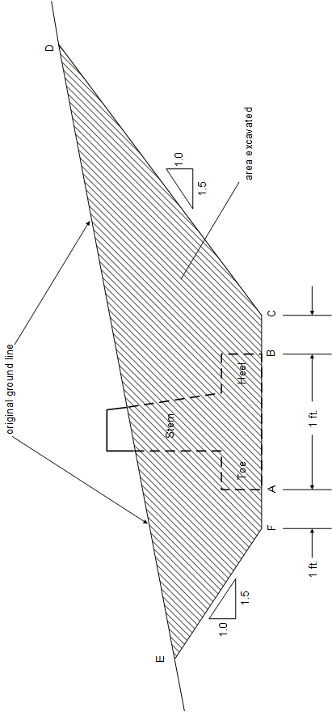
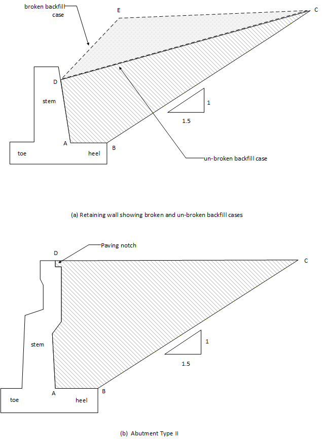
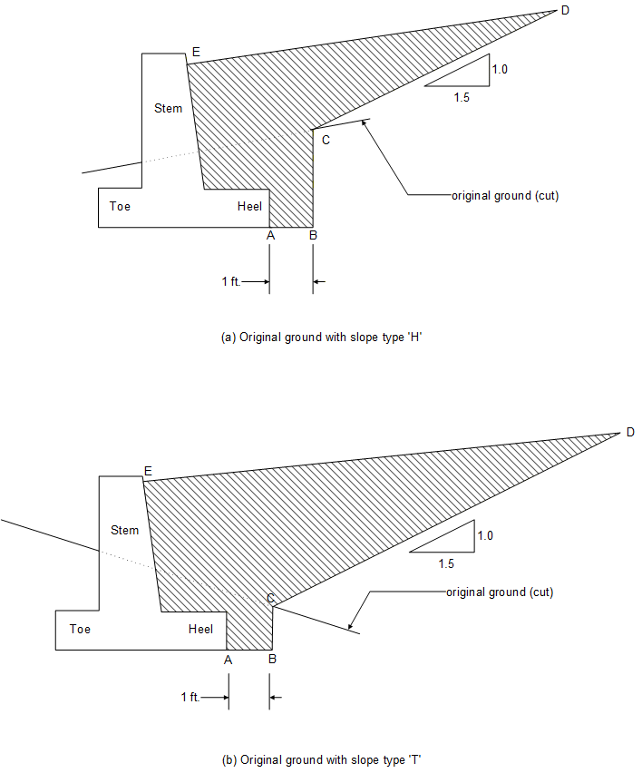
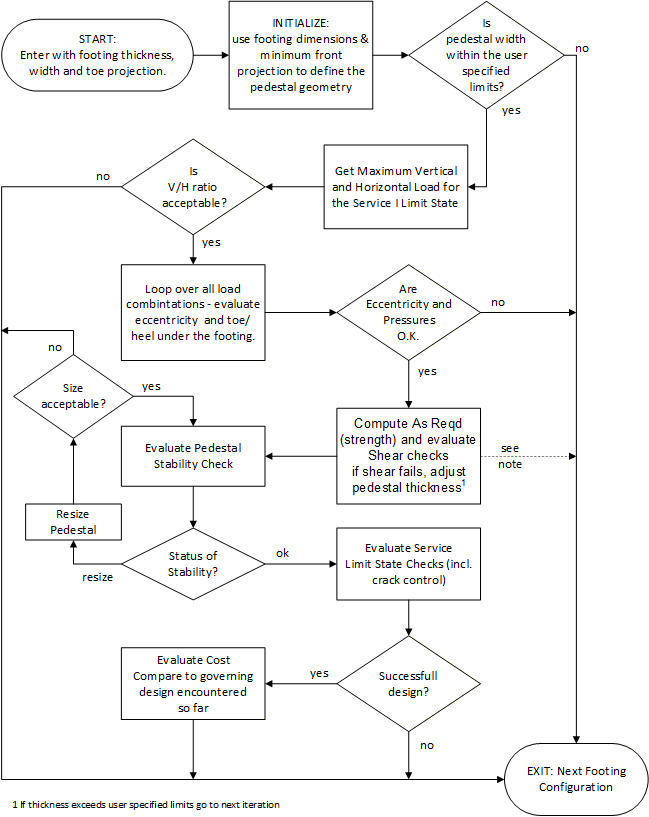
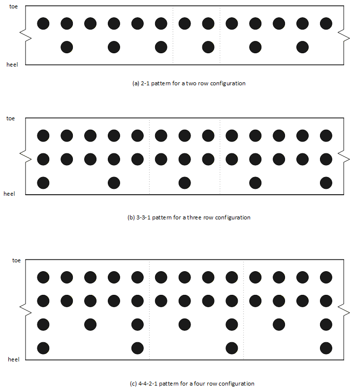
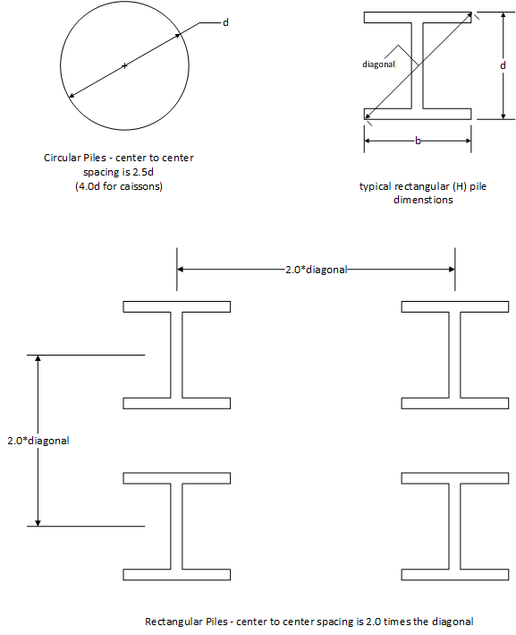

## 3.7 &emsp; Design Considerations

The algorithm to select the optimal design solution varies for each type of footing (spread, pile, caisson, or pedestal). The following sections describe the unique features of the design algorithm and the choice of the optimal design solution for each footing type - spread in Section 3.7.1, pedestal in Section 3.7.2, and pile/caisson in Section 3.7.3.

### Spread Footings 

> This section addresses the special considerations that are applied to spread footings. Design algorithm issues are addressed in Section 3.7.1.1. Design optimization issues are described in Section 3.7.1.2.

#### Design Algorithm

> The algorithm follows the generic procedure of iterating through the footing geometry configurations that were described in Section 3.2.1. Footing Stability and Reinforcement design checks are applied for each footing configuration. Stability checks are described in Section 3.4.1. Reinforcement checks are identified in Section 3.5.2.

#### Evaluation of Optimal Design

> The program will evaluate the cost of all successful configurations (all strength and serviceability checks were satisfied). The cost of the footing is a relative measure of optimal design. The cost function for spread footings may be based solely on the footing volume or on the cost required for the concrete footing and the cost of the excavation (if specified) and backfill. These procedures apply to footings founded on either soil or rock. The choice is specified in the SPR command (Section 5.11).
>
> The volume option only considers the footing area per unit length, i.e. the volume is the footing thickness multiplied by the footing width multiplied by a unit length of the substructure. If two configurations have the same volume, the program will select the configuration with the minimum toe projection. During the design, the program stores the design minimum footing volume. When footing width and thickness are incremented, the program ignores any footing size that exceeds the minimum volume.
>
> If the cost option is selected, the user must specify if the structure is situated in a cut or in a fill. In either case, the cost includes the cost of the volume of concrete required for the footing. The unit costs for concrete, excavation (if specified), and backfill must be entered by the user. The costs are based on a unit length of the substructure.

The cost of a structure (per unit length of the substructure) situated in a fill will be:

- the cost of the concrete footing (footing volume times concrete cost); plus,

- the cost of the backfill material (fill area times cost of backfill).

The cost of a structure (per unit length of the substructure) situated in a cut will be:

- the cost of the concrete footing (footing volume times concrete cost); plus,

- the cost of the excavation (cut area times cost of excavation); plus,

- the cost of the backfill material (fill area times cost of backfill).

Costs of excavation, backfill and concrete are specified in units of \$/yd3 in the SPR command (Section 5.11).

A structure is considered to be situated in a cut if part of the original ground surface must be excavated (i.e. cut) in order to construct the structure.

If the user specifies that the structure is in a cut, the program will compute the cost for both the excavation and backfill. If the structure is situated in a fill, the program evaluates the cost of the backfill only. The program assumes a unit length of the substructure, hence the description is based on the cut area and the fill area.

Figure 3.7.1-1 shows the cross sectional area of the material that is cut. It is applicable for footings in either soil or rock. The area is bound: on the top by the original ground line ED; at the bottom by the elevation of the footing base, line FC, and on the sides by lines (EF and DC) that have a slope of 1 vertical unit per 1.5 horizontal units. Point F is located 1 ft to the left of the toe. Point C is located 1 ft to the right of the heel.

|     |
|-----|
|     |

**Figure 3.7.1-1 Cut Area For Structures Situated In a Cut**

##### Backfill Area for Structures Situated In a Fill

> Figure 3.7.1-2 illustrates the backfill areas for structures situated in a fill. Figure 3.7.1-2(a) shows the backfill area for a retaining wall with two backslope configurations. The backfill area is bound: at the top by the backfill surface; on the left side by the outline of the back face of the stem; on the bottom by the two line segments: line AB that is the top surface of heel projection; and, line BC that extends from the top corner of the heel at a slope of 1 (vertical) to 1.5 (horizontal) until it intersects the surface of the backfill. Hence, the backfill area for the straight backfill case is defined by the polygon ABCD, and the broken backfill case is defined by the polygon ABCED.
>
> Figure 3.7.1-2(b) illustrates the backfill area of an Abutment Type II structure. Note that the backfill area extends into the paving notch area. The backfill area is defined by the striped area behind the backwall i.e. ABCD.

##### Backfill Area for Structures Situated In a Cut

> Figure 3.7.1-3 illustrates the backfill areas for structures situated in a cut. Two variations are shown in the figure: (a) when the original ground is sloping upwards towards the heel (slope type ‘H’ in the SPR command); and (b) when the original ground slope is sloping upwards towards the toe (slope type ‘T’ in the SPR command).
>
> The backfill area is defined by the polygon ABCDE that is constrained: on the top by the surface of the backfill (line DE); on the left side by back face of the stem and heel projection; at the bottom by a 1 ft horizontal line (AB) extending from the base of the heel (point A); on the right side by two line segments; one a vertical segment BC that intersects the original ground line 1 ft to the right of the heel, and another segment that extends from the intersection point (c) at a slope of 1 (vertical) to 1.5 (horizontal) until it intersects the backfill at point D.

##### Special Cases of Backfill Areas for Structures Situated In a Cut

> Figure 3.7.1-4(a) illustrates the case when the original ground is above the backfill elevation. The backfill area is bound: on the top by the backfill surface (line CD); on the left side by the back face of the stem and heel projection; on the bottom by a line (AB) extending 1 ft to the right from the base of the heel; on the right side by a vertical line (BC) situated 1 ft from the right of the heel that intersects the backfill.
>
> Figure 3.7.1-4(b) illustrates the case when the original ground slope (type ‘H’) is steeper than 1 (vertical) to 1.5 (horizontal). This case is a variation of that shown in Figure 3.7.1-3(a). The difference is that the line segment CD has a steeper ground slope value instead of the 1 (vertical) to 1.5 (horizontal) slope.

**Figure 3.7.1-2 Examples of Backfill Area for Structures Situated in a Fill**

**Figure 3.7.1-3 Examples of Backfill Areas for Structures Situated in a Cut**

Figure 3.7.1-4 Special Cases of Backfill Areas for Structures Situated in a Cut

> If two configurations have the same cost, the program will select the configuration with the least footing volume. If two configurations have the same cost and the same footing volume, the program will select the configuration with the maximum toe projection.

### Pedestal Footings 

> The program is iterating through a range of footing configurations as described in Section 3.2.1. For each footing configuration (thickness, width, toe projection), the program will search for a pedestal configuration that satisfies the design specifications.
>
> Section 3.7.2.1 describes the algorithm that is used to iterate through the range of user-specified pedestal configurations. The selection process for determining the optimal design from a set of successful geometrical configurations is described in Section 3.7.2.2.

#### Pedestal Design Algorithm

As the program iterates through the set of footing configurations, another set of iterations is performed for the pedestal geometry for each footing configuration. This section describes the pedestal design procedure. It refers to the step entitled “evaluate footing checks and perform pedestal design ...” at the top left hand side of Figure 3.2.1-2. The flowchart in Figure 3.7.2-1 is an overview the design procedure.

The pedestal design consists of three types of checks:

- Footing stability on the pedestal (Sections 3.4.2.1 through 3.4.2.1.3)

- Pedestal stability (Section 3.4.2.4) on the foundation

- Footing flexure (strength and serviceability) and shear (Section 3.5.1.3)

The results of these checks will determine how the pedestal geometry is adjusted. The variations in pedestal geometry are identified in Figure 3.7.2-2.

The set of pedestal configurations is defined by the user-specified maximum and minimum pedestal width, and the width incremental value which is a program parameter set to 3 inches. The user also specifies a range (minimum, maximum) of values for the pedestal thickness. The incremental value for the pedestal thickness is a program parameter set to 1 inch. Figure 3.7.2-2 is an overview of the salient features of the pedestal design.

**Figure 3.7.2-1 Outline of Pedestal Design Procedure**

Figure 3.7.2-2 Pedestal Configurations for Design

> The front projection as per DM-4 and the height of the pedestal as specified by the user are fixed for the design problem. In a design run, the user should not specify the pedestal back offset nor the front projection. The restrictions for input are described in the PED command (Section 5.14).
>
> For a given footing configuration, the program will start with a pedestal configuration such that the front projection is set to 1 ft., and the back offset set to the value of footing thickness. Given the footing width, front projection, back offset and the horizontal projection of the pedestal front slope, the pedestal width can be computed. The width must be less than the maximum width and greater than the minimum width as specified by the user. If the maximum pedestal width is not specified, the default value is set to twice (program parameter) the footing width.
>
> If the pedestal width falls outside the acceptable range, that configuration is ignored by the program. The program will skip to the next iteration in the footing iteration scheme (Section 3.2.1 through 3.4.2.3). As the footing dimensions (width and thickness) change, new pedestal dimensions will be computed.
>
> When the program encounters a pedestal width that satisfies the geometrical requirements described above, the program will apply the stability (footing on pedestal) checks as described in Section 3.4.2. Sliding is checked by evaluating the ratio of vertical to horizontal loads. It is the first stability check to be evaluated as shown in Figure 3.7.2-1. If the bearing pressure check or the eccentricity check fails, the program will skip to the next iteration in the footing geometry.
>
> If the footing is stable (see Section 3.4.2), the area of steel required (based on strength requirements) in the footing in the parallel direction is evaluated. The calculation of the applied moments (strength and service) is described in Section 3.5.1.3.1. The shear check, as described in Section 3.5.1.3.2, is also evaluated.
>
> If the footing shear check fails, the program will skip to the next iteration in the footing geometry. Otherwise, the rebar spacing calculations are performed based on the area of steel required, as described in Section 3.5.2.
>
> In the next step, the program evaluates the pedestal stability, i.e. pedestal on foundation as described in Section 3.4.2.4. There are three outcomes: bearing failure; eccentricity failure; or success.
>
> If there is a bearing pressure failure, the program adjusts the pedestal thickness by an increment (by 1 inch), and the program re-evaluates the stability checks for the given width.
>
> The pedestal thickness influences the parallel moment in the footing, because the clear spacing between pedestals, as described in Section 3.5.1.3, changes as the pedestal thickness changes. Hence, the reinforcement checks are affected by changes in the pedestal thickness. The program performs the footing reinforcement (strength and serviceability) design only after the pedestal stability checks are satisfied. Changes in the thickness are only applied if the foundation bearing pressure check fails. That is, the pedestal thickness is incremented by 1 inch and the check is evaluated again if the new dimension is within the allowable limits specified by the user.
>
> If an eccentricity failure occurs, the pedestal is resized. As the pedestal width is increased incrementally by 3 inches, the back offset is reduced by a corresponding decrement. When the back offset has reached the minimum allowable value of 1 ft., further increments in the pedestal width are matched by corresponding adjustments (increases) in the front projection.
>
> After the pedestal width has been adjusted, the program will re-evaluate the pedestal stability. The program will ensure that the pedestal width falls within the acceptable limits. If the limits are exceeded, the program will skip to the next iteration of the footing geometry.
>
> If the pedestal is stable (passes the eccentricity, bearing and settlement checks), the program will perform serviceability (the crack control) checks for the footing rebar as described in Section 3.5.2. To ensure that the variations in pedestal geometry have not altered the footing stability, the program will re-check the footing and pedestal stability.
>
> If the program can find at least one bar that satisfies the serviceability requirements, the geometry is considered to be satisfactory and the pedestal economy (Section 3.7.2.2) is evaluated.
>
> If the program cannot find a satisfactory solution given all of the variations in footing and pedestal geometry, a message is printed and the program terminates.

#### Evaluation of Pedestal Optimal Design

> If all the checks (stability, strength and serviceability) are satisfied for a given footing/pedestal configuration, the cost of that configuration is evaluated. The cost function for pedestal footings may be based on pedestal density or on least footing volume. It is specified in the PED command (Section 5.14).
>
> The pedestal density is defined as the pedestal volume divided by the pedestal center-to-center spacing (see Figure 5.14-1). The optimal design is the configuration with the least pedestal density. If two configurations have the same density, the least footing volume is used to select the optimal design. If the pedestal density and footing volumes are the same, the configuration with the minimum footing toe projection is selected.
>
> The footing volume is defined as the thickness times the width times the length of the footing. The footing length is entered as the third input value on the RCK command. Pedestals must be founded on rock. The optimal design is the configuration with the least footing volume. If two configurations have the same footing volume, the configuration with the least pedestal density is selected. If the footing volume and pedestal density are the same, the configuration with the minimum footing toe projection is selected.

### Pile/Caisson Footings 

> The program iterates through a range of footing configurations as described in Section 3.2.1. For each footing configuration (thickness, width, toe projection), the program will search for an optimal pile placement geometry. Throughout this Section, the term ‘caisson’ can be used interchangeably with the term ‘pile’.
>
> This section addresses the special considerations that are applied to pile footings. Design algorithm issues are addressed in Section 3.7.3.1. Design optimization issues are described in Section 3.7.3.2.

#### Design Algorithm for Pile Footings

> Inherent to the pile design algorithm is the use of patterns for placement of piles. This section therefore begins by describing pile patterns used in the program. Limits on spacing between piles are then outlined followed by a discussion of the design algorithm itself. The design algorithm is sufficiently complex as to warrant an example found at the end of this section. The example is referred to throughout the discussion of the design algorithm.
>
> For each footing configuration (toe, heel, thickness and width), the program iterates through a set of pile patterns. A pile pattern is a numeric representation of the distribution of piles throughout the footing. It describes the number of pile rows and the number of piles in each row relative to the other rows. For example, the ‘4-4-2-1’ pattern indicates four rows of piles. For every 1 pile in the fourth row, there are 4 piles in the first row, 4 in the second and 2 in the third. Pile patterns are identified in Table 3.7.3-1.
>
> Piles and caissons may be arranged into a minimum of two rows, and a maximum of five rows. The first digit in the pattern definition represents the relative number of piles in the row closest to the toe. The remainder of the numbers correspond to piles in the rows that follow. Piles are positioned so that they are aligned with piles in other rows, thus allowing easy placement of reinforcement between piles. This is illustrated more clearly in Figures 3.7.3-1(a), (b) and (c) which show pile patterns ‘2-1’, ‘3-3-1’ and ‘4-4-2-1’ respectively. In this figure, the pile pattern is outlined by a dashed line. Note that the pattern is replicated along the length of the footing.

**Figure 3.7.3-1 Schematics of Sample Pile Patterns**

<table style="width:79%;">
<caption>
Table 3.7.3-1 Pile Patterns used in the Program
</caption>
<colgroup>
<col style="width: 18%" />
<col style="width: 59%" />
</colgroup>
<tbody>
<tr>
<td style="text-align: center;"><strong>Number of Rows</strong></td>
<td style="text-align: center;"><strong>Pile Pattern Definition</strong></td>
</tr>
<tr>
<td style="text-align: center;">2</td>
<td style="text-align: center;">1-1 2-1 3-1 4-1 5-1</td>
</tr>
<tr>
<td style="text-align: center;">3</td>
<td style="text-align: center;">
1-1-1 2-1-1 2-2-1 3-1-1 4-1-1

3-3-1 4-2-1 5-1-1 4-4-1 5-5-1
</td>
</tr>
<tr>
<td style="text-align: center;">4</td>
<td style="text-align: center;">
1-1-1-1 2-1-1-1 2-2-1-1 3-1-1-1 2-2-2-1

4-1-1-1 3-3-1-1 4-2-1-1 5-1-1-1 4-2-2-1

3-3-3-1 4-4-1-1 4-4-2-1 5-5-1-1 4-4-4-1 5-5-5-1
</td>
</tr>
<tr>
<td style="text-align: center;">5</td>
<td style="text-align: center;">
1-1-1-1-1 2-1-1-1-1 2-2-1-1-1 3-1-1-1-1 2-2-2-1-1 4-1-1-1-1

2-2-2-2-1 3-3-1-1-1 4-2-1-1-1 5-1-1-1-1 4-2-2-1-1 3-3-3-1-1

4-2-2-2-1 4-4-1-1-1 4-4-2-1-1 3-3-3-3-1 4-4-2-2-1 5-5-1-1-1

4-4-4-1-1 4-4-4-2-1 4-4-4-4-1 5-5-5-1-1 5-5-5-5-1
</td>
</tr>
</tbody>
</table>

> It is important to note that the pile pattern is only a representation of the relative number of piles in each row and the pattern is expected to be repeated along the length of the physical abutment. The pattern is reflected in the pile spacings output by the program. For Design runs the program reports the pattern definition it uses in the Design algorithm, However it is the user’s responsibility to apply the computed spacings to the physical footing.
>
> Spacings between pile rows and spacings within a pile row are limited by user input and the DM-4 Section 10.7.1.2. Spacing limits between piles are applicable in both the parallel and perpendicular directions (DM‑4 Section 10.7.1.2):

- Maximum center to center spacing: 15 ft

- Minimum center to center spacing: 3 ft or

2.5 times circular pile diameter DM-4 Section 10.7.1.2

2.0 times rectangular pile diagonal

(the diagonal is equal to $`\sqrt{d^{2} + b^{2}}`$)

> 4.0 times caisson diameter LRFD Specifications Section 10.8.1.2
>
> Figure 3.7.3-2 illustrates the minimum center to center spacing more clearly. Other limits include the following from DM-4 Section 10.7.1.2:

- Minimum footing edge to center of pile spacing: 18 in

- Minimum footing edge to edge of pile spacing: 9 in

- Minimum pile footing thickness: 2.5 ft

- Minimum pile embedment: 1 ft

**Figure 3.7.3-2 Pile Spacings ‑ Center to Center**

> Many of the limits described above can be checked before the actual design algorithm is executed and the program terminates if a limit is violated. Other limits are used within the design algorithm to assure complicity with the DM-4 specifications.

The design algorithm begins by placing rows of piles and then determining the spacing of piles within the rows. Example 1 at the end of this section represents the application of the design algorithm for a given footing configuration and pile pattern, and is useful as a reference for the following discussion. A convention has been adopted so that when a value is discussed, it can easily be found in the example problem. When (#N) is found in the text, the reader is directed to line N of the example problem to see the computed value.

For a given pattern, the program first determines whether the number of pile rows can fit within the footing width using the minimum spacing and edge distance limits. If the number of rows will fit, the first pile row is placed at the toe-to-first-row dimension and the last pile row is placed at the heel-to-last-row dimension. Interior pile rows are positioned evenly across the footing width or placed close to the toe depending on user input. Even placement results in interior pile rows placed at even intervals between the first and last row. If rounding is desired, the interior row positions relative to the first row are rounded to the nearest desired multiple, as input by the user. Rows placed close to the toe results in the interior rows positioned close to the toe, spaced at the minimum rounded up spacing entered by the user. The spacing between pile rows must conform to the minimum and maximum spacing criteria, or the pattern is rejected.

Once the pile rows have been positioned, the pile group centroid and moment of inertia are computed.

The pile group centroid is computed using this equation:

> Where: *CG is the centroid of the pile group relative to the toe*

*NPi is the number of piles in the ith row from the pattern definition*

*Di is the distance of the ith row from the toe of the footing*

The moment of inertia used in the design algorithm is computed as if the entire pattern could fit within a unit length of abutment. This assumption is accounted for in the design algorithm equations that determine pile spacing within a row. Once the final layout of piles is determined, the moment of inertia is then modified to reflect a unit length of footing.

For the purposes of the design algorithm, the following equations are used:

$`I_{g} = \sum_{}^{}{NP_{i}c_{i}^{2}}`$ and $`c_{i} = CG - D_{i}`$

> Where: *Ig is the moment of inertia of the pile group*

*ci is the distance of the ith row to the centroid of the pile group*

The program then computes vertical pile loads and lateral loads for the pile group for each limit state load combination except for the Service limit state. Vertical pile loads are calculated using this equation:

> Where: *Vi is the vertical load on a pile in the ith row*

*Vftg is the vertical load (per unit length) acting at the footing bottom*

*NPtot is the total number of piles from the pattern definition*

*e is the distance from the vertical load to the centroid of the pile group*

The objective is now to determine the pile spacing within each row of piles. The program finds the greatest spacing allowed by the limits previously described so as to minimize the number of piles required to carry the load. The program batters piles if necessary to carry the load, starting with the row closest to the toe and moving toward the heel. If the user does not specify batter information in the input, the program will only consider an all vertical pile foundation and the references to battered piles that follow are not applicable.

The user enters two types of pile resistance which are used to determine pile spacings within a row. The user enters the lateral resistance of the pile assuming an all vertical pile foundation (#12). This resistance is generally obtained from an independent analysis using a program such as COM624 and is only applicable if all piles are vertical. The other resistance is the axial capacity of a pile (#11). For vertical piles, the axial capacity resists vertical loads but makes no contribution for lateral resistance. For battered piles, the axial capacity is resolved into a vertical and horizontal capacity (#16) using the batter slope and trigonometry. If the designed pile foundation has battered piles, the horizontal resistance is derived solely from the horizontal component of the axial capacity of piles that are battered.

The program computes pile spacings required to satisfy various conditions, such as vertical and lateral loads on vertical and battered piles. These spacings are collected for each row and a controlling spacing is determined. The equations consider each pile row separately, but produce a spacing for the row with the most piles in it (typically the first row). Therefore, as seen throughout the example problem, all computed spacings apply to the first row. After the design algorithm has found a satisfactory spacing for the first row, subsequent row spacings are simply a multiple of the first row spacing, depending on the number of piles for the row found in the pile pattern.

A corollary to the above assumption is that the maximum input pile spacing must be related to the row with the most piles. In other words, piles in the first row must be spaced such that piles in the last row will satisfy the maximum spacing criteria. This is accomplished with the following equation:

> Where: *Smax is the maximum spacing of piles in the first row*

*INmax is the maximum input spacing of piles*

*NPmin is the least piles in a row (last row)*

*NPmax is the most piles in a row (first row)*

The program begins by computing the pile spacing in each row required to carry the vertical load on the row. The spacing is computed first by assuming all piles in the row are vertical and then assuming all piles in the row are battered using the equations that follow:

> Where: *SiVPVL is the pile spacing in the ith row (piles are vertical)*

*SiBPVL is the pile spacing in the ith row (piles are battered)*

*CAPA is the axial capacity for a pile*

*CAPV is the vertical component of axial capacity for a battered pile*

*NPmax is the most piles in a row (first row)*

The computed spacings are rounded down based on the input rounding values. If the vertical pile spacing for any row is less than the minimum spacing (#8), the pile group is unable to support the vertical load and a new pattern is tried.

Spacings required to resist vertical loads (computed above) are stored in a particular way that facilitates comparisons later on. For vertical piles, the stored spacing at a given row is the minimum of the computed spacing for the rows that follow. For battered piles on the other hand, the stored spacing at a given row is the minimum of the computed spacing for that row and any row towards the toe. This step is necessary when considering a partially battered pile footing, as explained below.

The algorithm only batters piles necessary to handle the lateral load, battering the first row and moving towards the heel. An intermediate row might be partially battered, while rows closer to the toe are assumed fully battered and rows closer to the heel are assumed fully vertical. Therefore, when comparing spacings for a given row, rows closer to the toe are controlled by battered pile spacings while rows closer to the heel are controlled by vertical pile spacings.

The program then computes the spacing required for an all vertical pile foundation to resist the lateral load on the foundation. This equation uses the COM624 capacity:

> Where: *SVPHL is the pile spacing*

*C624 is the lateral capacity of a pile in an all vertical pile foundation*

*Hftg is the lateral load (per unit length) applied to the pile group*

*NPmax is the most piles in a row (first row)*

*NPtot is the total number of piles from the pattern definition*

The spacing required for battered piles to resist the lateral load is then computed. The equation is similar to the previous equation, but the capacities are cumulative because the first rows of piles may be battered while the last rows may be vertical:

> Where: *SBPHL(I) is the pile spacing in the ith row (piles are battered)*

*NPcum(I) is the cumulative number of battered piles for rows 1 to I*

*CAPH is the axial pile capacity horizontal component for a battered pile*

*Hftg is the lateral load (per unit length) applied to the pile group*

For this step, the program batters all piles in a given row and later determines whether only a percentage of battered piles in the row will suffice. Implicit in this method is the assumption that for a partially battered pile row, the vertical load is resisted by fully battered piles in the row.

Now that the spacings for various configurations have been computed, the controlling spacing must be determined. For an all vertical pile foundation, the spacing is the minimum of SVPVL(I) and SVPHL, as long as the minimum and maximum spacing limits are not violated. These spacings are shown in the example (#24, 25).

For a given row in a battered pile foundation, the spacing is the minimum of the stored values for SVPVL(I), SBPVL(I) and SBPHL(I) (#27, 29, 31, respectively). A valid spacing conforms to the input minimum and maximum spacing limits and is shown in the example (#32). The greatest valid spacing considering all rows is the control (#33). After the controlling spacing has been found, the program then determines how many piles to batter \#36-39.

The above steps are performed for every applicable limit state load combination for a given pile pattern. Once the controlling spacing is found for the row with the most piles, the spacings of piles in all rows can be determined based on the pile pattern. A check is then made to determine if the footing and pile geometry is optimal (Section 3.7.3.2).

If a footing and pile configuration is determined to be optimal, design of the footing reinforcement is performed. The applied moments are obtained as described in Section 3.5.1.2. If the footing reinforcement design has a satisfactory solution, the footing and pile configuration is saved as an optimal design. Otherwise, the design is discarded. If a pattern is found to be unsatisfactory due to punching shear in the footing, the program will reanalyze the same pattern with a reduced pile spacing. This process is iterative and reduces the pile spacing until either a valid design is found, or the pile stability / spacing checks fail.

If the pile stability or spacing check fails at any time, a new pile pattern or footing configuration is tested. If a solution is not obtained, the program will issue a message and then terminate.

Example 1 Pile Design Algorithm

|  |  |  |  |
|:---|---:|---:|:--:|
| **Input Data** | Assumptions |  | Line \# |
| Footing width: 9.00 | Rows are placed evenly |  | 1 |
| Toe to first row: 1.50 | Spacings are not rounded |  | 2 |
| Heel to last row: 1.50 |  |  | 3 |
|  |  |  |  |
| Number of rows: 3 | Vertical batter: 3.00 |  | 4 |
|  | Horizontal batter 1.00 |  | 5 |
| Pile Row Pile / Row |  |  |  |
| Pattern 1 2 | Last row % batter: 0.0% |  | 6 |
| Data 2 1 |  |  | 7 |
| 3 1 | Minimum spacing: 3.00 |  | 8 |
|  | Maximum spacing: 15.00 |  | 9 |
|  |  |  | 10 |
| Axial pile capacity: 25.00 |  |  | 11 |
| Lateral pile capacity: 3.50 | (COM624 - All piles are vertical) |  | 12 |
|  |  |  |  |
| Vertical load: 14.70 | Toe to load: 3.67 |  | 13 |
| Horizontal load: 3.90 |  |  | 14 |
| (per unit length of footing) |  |  |  |
|  |  |  |  |
| **Computed Load and Pile Data** |  |  |  |
| Total number piles: 4 | Battered pile capacities |  | 15 |
|  | Vertical Horizontal |  |  |
| Max piles in a row: 2 | 23.72 7.91 |  | 16 |
| Min piles in a row: 1 |  |  | 17 |
| Max spacing (Row 1): 7.50 |  |  | 18 |
|  | Toe to CG Piles: 3.75 |  | 19 |
| Load Eccentricity 0.08 | Pile Group Inertia: 4.75 |  | 20 |
| **1 2 3** |  |  |  |
| Dist tow to row: 1.50 4.50 7.50 |  |  | 21 |
| Dist CG piles to row: 2.25 -0.75 -3.75 |  |  | 22 |
| Vertical load on pile: 3.78 3.64 3.50 |  |  | 23 |
| (per unit length of footing) |  |  |  |

|  |  |  |
|----|---:|:--:|
| **Computed Spacings** |  |  |
| Note: All spacings are computed from the row with the most piles (the first row) |  |  |
|  |  |  |
| **All vertical pile foundation spacings** |  |  |
| Spacing for vertical loads: 3.3052 OK |  | 24 |
| Spacing for lateral loads: 1.7949 NG |  | 25 |
|  |  |  |
| **Battered pile foundation spacings** |  |  |
| Legend: V = vertical, B = battered, L = lateral |  |  |
| Row: 1 2 3 |  |  |
| V loads, V piles 3.3052 3.4347 3.5747 |  | 26 |
| Store (for B piles) 3.4347 3.5747 3.5747 |  | 27 |
| OK OK OK |  |  |
|  |  |  |
| V loads, B piles 3.1356 3.2584 3.3912 |  | 28 |
| Store (for B piles) 3.1356 3.1356 3.1356 |  | 29 |
| OK OK OK |  |  |
|  |  |  |
| \# of B piles (cumul.) 2 3 3 |  | 30 |
| L loads, B piles 2.0271 3.0407 3.0407 |  | 31 |
| NG OK OK |  |  |
|  |  |  |
| Valid spacing (min) NG 3.0407 3.0407 |  | 32 |
| Best valid spacing 3.0407 |  | 33 |
|  |  |  |
| First Row Spacing Summary All vertical piles: 1.79 NG |  | 34 |
| Battered piles: 3.04 OK |  | 35 |
|  |  |  |
| Batter Summary \# piles to batter: 3 |  | 36 |
| Last battered row: 2 |  | 37 |
| Actual spacing: 3.04 6.08 6.08 |  | 38 |
| Percent batter: 100.0% 100.0% Vert |  | 39 |

#### Evaluation of Pile Optimal Design

The user has the following choices for the optimizing parameter: least pile density; minimum footing volume; and minimum foundation installation cost. The pile density is defined as the number of piles per unit length of abutment. The footing volume is defined as the footing width multiplied by the footing thickness per unit. The foundation installation cost. The footing and pile costs are specified in the LYD command (see Section 5.15).

If pile density is selected as the optimizing parameter and two configurations have the same density, the footing volume is used to determine the optimal design. If both configurations have the same footing volume, the configuration with the minimum toe projection will be selected as optimal.

If footing volume is selected as the optimizing parameter and two configurations have the same volume, the pile density is used to determine the optimal design. If both configurations have the same density, the configuration with the minimum toe projection will be selected as optimal. During the design iterations, the program stores the design minimum footing volume. When footing width and thickness are incremented, the program ignores any footing size that exceeds the minimum volume.

If the installation cost is selected as the optimizing parameter and two configurations have the same cost, the configuration with the least toe projection will be selected as optimal.

### Shear Design

Shear design for footings follows the analysis procedure; refer to Section 3.5.2.9 for a description of the requirements. If the shear check is not satisfied in a design run, the footing configuration will be rejected. The program will skip to the next iteration of the footing geometry. The shear check is a function of the thickness of the footing.

Changes in the stem position (toe/heel projections) will alter the applied shear load. Changes in the footing thickness will affect the shear capacity of the footing sections.

The shear check as described in Section 3.5.2.9 is evaluated at the stem quarter points and backwall and seat level (if applicable). Stem and backwall sections are not modified by the program. Hence, the shear capacity cannot be increased. If there is a shear failure, the program will identify the point in the output.

If a solution cannot be found because there is a shear problem in the stem, the geometry (i.e. batter or stem thickness) may have to be revised. A larger section will provide a greater shear resistance.

Similarly, if there is a shear problem in the footing, the user can increase the upper limit of the footing thickness in the FTG command. By allowing the program to consider thicker footings, an acceptable solution may be found.

Alternatively, the user can change the strength of concrete. It is recommended that the user should check the magnitude of the applied loads, they may be unreasonably high.
